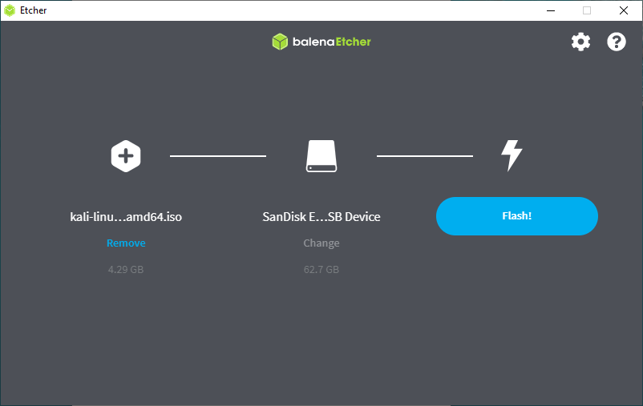
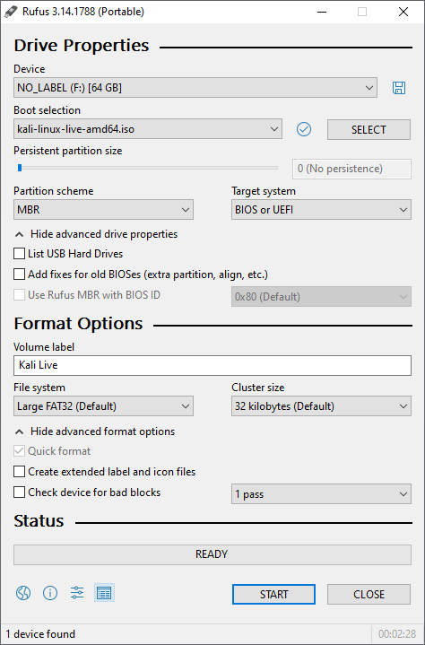
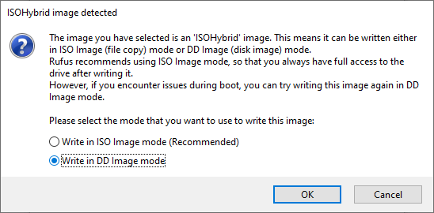
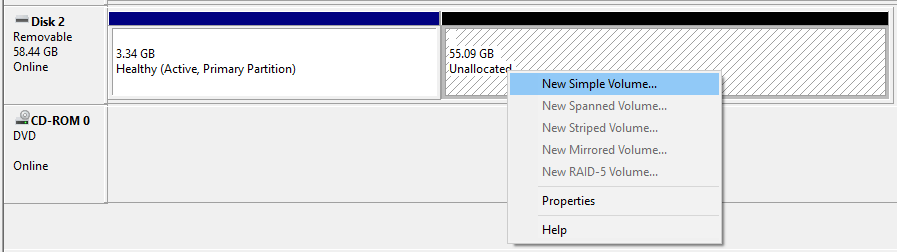

# Making a Kali Bootable USB Drive on Windows

One of the fastest method, for getting up and running with Kali Linux is to run it “live” from a USB drive. This method has several advantages:

* It’s non-destructive - it makes no changes to the host system’s hard drive or installed OS, and to go back to normal operations, you simply remove the Kali Live USB drive and restart the system
* It’s portable - you can carry Kali Linux in your pocket and have it running in minutes on an available system
* It’s customizable - you can [roll your own custom Kali Linux ISO image](https://www.kali.org/docs/development/live-build-a-custom-kali-iso/) and put it onto a USB drive using the same procedures
* It’s potentially persistent - with a bit of extra effort, you can configure your Kali Linux “live” USB drive to have [persistent storage](broken-reference), so the data you collect is saved across reboots

In order to do this, we first need to create a bootable USB drive which has been set up from an ISO image of Kali Linux.

The specifics of this procedure will vary depending on whether you’re doing it on a [Linux](broken-reference), [macOS/OS X](broken-reference), or [Windows](broken-reference) system.

[**What You’ll Need**](broken-reference)

1. A [_verified_](https://www.kali.org/docs/introduction/download-official-kali-linux-images/) copy of the [appropriate ISO image](https://www.kali.org/docs/introduction/what-image-to-download/) of the latest Kali build image for the system you’ll be running it on.
2. If you’re running under Windows, there is not one tool that is considered the overall best for imaging. We recommend [Etcher](https://www.balena.io/etcher/) _(installer or portable)_ as it is simpler to use, however [Rufus](https://rufus.ie/) is another popular option with its advance options. If one does not work for you, consider the other.
3. A USB drive, 8GB or larger _(Systems with a direct SD card slot can use an SD card with similar capacity. The procedure is identical.)_

***

[Creating a Bootable Kali USB Drive on Windows (Etcher)](broken-reference)

1. Plug your USB drive into an available USB port on your Windows PC, note which drive designator (e.g. “`G:\`”) it uses once it mounts, and launch **Etcher**.
2. Click **Flash from file**, and locate the Kali Linux ISO file to be imaged with.
3. Click **Select target** and choose the USB drive you want to make bootable.
4. Click the **Flash!** button once ready.

_Note: You may get a UAC prompt asking for administrator privileges that you will need to accept._

5\. Once Etcher alerts you that the image has been flashed, you can safely remove the USB drive and proceed to boot into Kali with it.

_At the time of writing, Etcher will use MBR. This is to allow for the most hardware compatibility._

***

[Creating a Bootable Kali USB Drive on Windows (Rufus)](broken-reference)

1. Plug your USB drive into an available USB port on your Windows PC, note which drive designator (e.g. “`G:\`”) it uses once it mounts, and launch **Rufus**.
2. With **Device**, check the dropdown list of options for the USB drive (e.g. “`G:\`” and size).
3. **Boot selection** needs to point to point to the Kali Linux ISO file, which can be done by clicking the **SELECT** button
4. Depending on your configuration, you can set the **Partition scheme**, as well as **Target system**. If you are not sure, leave it as the default values.

While you can easily create a persistent live usb with the integrated options in rufus by increasing the persistence slider, this is not the officially supported method (check [Adding Persistence to a Kali Linux Live USB Drive](broken-reference)), as it doesn’t work for all images, like the **Kali Everything Live ISO** introduced in release 2022.1.

5. Click the **START** button once ready.

6\. You may get a prompt saying about **ISOHybird image**. Selecting ISO image, will allow you to edit the files from the Kali Linux ISO, but at the potential lose of hardware compatibility. As a result, we recommend selecting **DD Image**.

_Note: If you select “DD Image” option, you can create another partition on the USB drive, allowing you to use the rest of the space. Start -> Run (Windows + R) -> `diskmgmt.msc` -> Locate the USB drive -> Right-click in “Unallocated” -> New Simple Volume -> Follow the rest of the wizard with next, next, next…_

***

[Booting A USB Drive In Windows](broken-reference)

Depending on the system _(such as BIOS or UEFI)_, as well as the version of Windows, and how they are each configured, you may need to re-image the USB drive.

* **M**aster **B**oot **R**ecord (MBR) is often used on legacy systems that use BIOS as well as UEFI which has **C**ompatibility **S**upport **M**odule (CSM) enabled
* **G**UID **P**artition **T**able (GPT) is required where UEFI has CSM disabled, forcing to use the modern standard

After writing the image to the USB drive, reboot Windows with the USB inserted. Depending on the motherboard manufacture, will also depend on the next stage. Some motherboard’s support a “temporary” boot menu, allowing for a one off selection. Others you need to enter BIOS/UEFI to configure it to try and boot from USB first. Entering either location, also depends on the motherboard. You can look up on the manufactures website and read the manual, try and read the screen when booting _(however the text may be shown too quick or full logos used)_, or try common key combinations (such as `ESC`, `F1`, `F2`, `F3`, `F4`, `F8`, `F10`, `F11`, `F12` or `DEL`).
