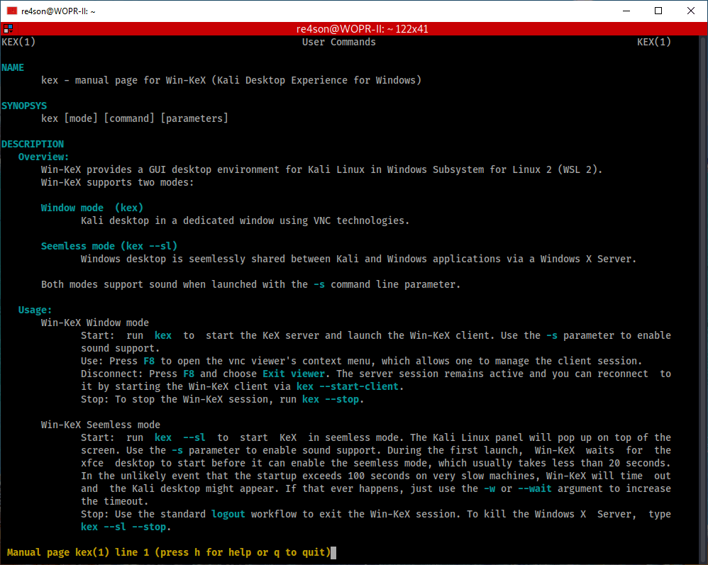

# Win-KeX

[Content:](broken-reference)

* [Overview](broken-reference)
* [Installation](broken-reference)
  * [Prerequisites](broken-reference)
  * [Install Kali Linux in WSL2](broken-reference)
  * [Install Win-Kex](broken-reference)
* [Run Win-KeX](broken-reference)
* [Optional steps](broken-reference)

[Overview](broken-reference)[**Win-KeX provides a Kali Desktop Experience for Windows Subsystem for Linux (WSL 2) with the following features:**](broken-reference)

* Window mode: start a Kali Linux desktop in a dedicated window
* Seamless mode: share the Windows desktop between Windows and Kali apps and menus
* Sound support
* Unprivileged and Root session support
* Shared clipboard for cut and paste support between Kali Linux and Windows apps
* Multi-session support: root window & non-priv window & seamless sessions concurrently
* Fully compatible with WSLg

[](<../../../.gitbook/assets/win kex sl.png>)

[**This page details the steps to install Win-Kex in under 2 minutes.**](broken-reference)[Installation](broken-reference)

All installation steps, up to the point where we install Win-Kex, are also explained in the 5 minute video guide by the amazing [NetworkChuck](https://twitter.com/NetWorkChuck):

[New Kali Linux GUI on Windows 10 (WSL 2) // 2020.3 Release](https://www.youtube.com/watch?v=dgdOILL1184)

[Prerequisites](broken-reference)

* Running Windows 10 version 2004 or higher
* Using [Windows Terminal](https://www.microsoft.com/en-us/p/windows-terminal/9n0dx20hk701)

[Install Kali Linux in WSL2](broken-reference)

* Open PowerShell as administrator and run:

```
Enable-WindowsOptionalFeature -Online -FeatureName Microsoft-Windows-Subsystem-Linux
```

* Restart
* Open PowerShell as administrator and run:

```
dism.exe /online /enable-feature /featurename:VirtualMachinePlatform /all /norestart
dism.exe /online /enable-feature /featurename:Microsoft-Windows-Subsystem-Linux /all /norestart
```

* Restart
* Download and install the WSL2 Linux Kernel from here: [https://aka.ms/wsl2kernel](https://aka.ms/wsl2kernel)
* Open PowerShell as administrator and run: `wsl --set-default-version 2`
*   Install Kali Linux from the Microsoft Store: \[https://apps.microsoft.com/store/detail/kali-linux/9PKR34TNCV07]

    Note: to upgrade an existing WSL1 kali-linux installation, type: `wsl --set-version kali-linux 2`
* Run Kali and finish the initial setup

[Install Win-KeX](broken-reference)

* Install win-kex via:

```
:~$ sudo apt update
:~$
:~$ sudo apt install -y kali-win-kex
```

[Run Win-KeX](broken-reference)[**Win-KeX supports three modes:**](broken-reference)

*   Window Mode:

    [](<../../../.gitbook/assets/win kex.png>)

    To start Win-KeX in Window mode with sound support, run

    `kex --win -s`

    Refer to the [Win-KeX Win usage documentation](broken-reference) for further information.
*   Enhanced Session Mode:

    [](<../../../.gitbook/assets/win kex 2.png>)
*   To start Win-KeX in Enhanced Session Mode with sound support and arm workaround, run

    `kex --esm --ip -s`

    Refer to the [Win-KeX ESM usage documentation](broken-reference) for further information.
*   Seamless mode:

    [](<../../../.gitbook/assets/win kex sl.png>)

    To start Win-KeX in Seamless mode with sound support, run

    `kex --sl -s`

    Refer to the [Win-KeX SL usage documentation](broken-reference) for further information.

[Optional Steps:](broken-reference)

* If you have the space, why not install “Kali with the lot”?: `sudo apt install -y kali-linux-large`

[](<../../../.gitbook/assets/win kex thelot.png>)

* Create a [Windows Terminal](https://www.microsoft.com/en-us/p/windows-terminal/9n0dx20hk701) Shortcut:

[](<../../../.gitbook/assets/win kex wt1.png>)

Choose amongst these options:

**Basic Win-KeX in window mode with sound:**

```
{
      "guid": "{55ca431a-3a87-5fb3-83cd-11ececc031d2}",
      "hidden": false,
      "name": "Win-KeX",
      "commandline": "wsl -d kali-linux kex --wtstart -s",
},
```

**Advanced Win-KeX in window mode with sound - Kali icon and start in kali home directory:**

Copy the kali-menu.png icon across to your windows picture directory and add the icon and start directory to your WT config:

```
{
        "guid": "{55ca431a-3a87-5fb3-83cd-11ececc031d2}",
        "hidden": false,
        "icon": "file:///c:/users/<windows user>/pictures/icons/kali-menu.png",
        "name": "Win-KeX",
        "commandline": "wsl -d kali-linux kex --wtstart -s",
        "startingDirectory" : "//wsl$/kali-linux/home/<kali user>"
},
```

**Basic Win-KeX in seamless mode with sound:**

```
{
      "guid": "{55ca431a-3a87-5fb3-83cd-11ececc031d2}",
      "hidden": false,
      "name": "Win-KeX",
      "commandline": "wsl -d kali-linux kex --sl --wtstart -s",
},
```

**Advanced Win-KeX in seamless mode with sound - Kali icon and start in kali home directory:**

Copy the kali-menu.png icon across to your windows picture directory and add the icon and start directory to your WT config:

```
{
        "guid": "{55ca431a-3a87-5fb3-83cd-11ececc031d2}",
        "hidden": false,
        "icon": "file:///c:/users/<windows user>/pictures/icons/kali-menu.png",
        "name": "Win-KeX",
        "commandline": "wsl -d kali-linux kex --sl --wtstart -s",
        "startingDirectory" : "//wsl$/kali-linux/home/<kali user>"
},
```

**Basic Win-KeX in ESM mode with sound:**

```
{
      "guid": "{55ca431a-3a87-5fb3-83cd-11ecedc031d2}",
      "hidden": false,
      "name": "Win-KeX",
      "commandline": "wsl -d kali-linux kex --esm --wtstart -s",
},
```

**Advanced Win-KeX in ESM mode with sound - Kali icon and start in kali home directory:**

Copy the kali-menu.png icon across to your windows picture directory and add the icon and start directory to your WT config:

```
{
        "guid": "{55ca431a-3a87-5fb3-83cd-11ecedd031d2}",
        "hidden": false,
        "icon": "file:///c:/users/<windows user>/pictures/icons/kali-menu.png",
        "name": "Win-KeX",
        "commandline": "wsl -d kali-linux kex --esm --wtstart -s",
        "startingDirectory" : "//wsl$/kali-linux/home/<kali user>"
},
```

[](<../../../.gitbook/assets/win kex wt1.png>)

[](<../../../.gitbook/assets/win kex wt2.png>)

[](<../../../.gitbook/assets/win kex full.png>)

[Help](broken-reference)

For more information, ask for help via:

`kex --help`

or consult the manpage via:

`man kex`

[](../../../.gitbook/assets/manpage.png)

or join us in the [Kali Forums](https://forums.kali.org/)

[**Enjoy Win-KeX!**](broken-reference)
