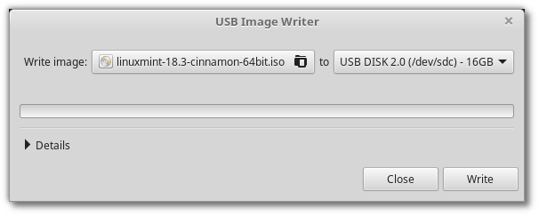
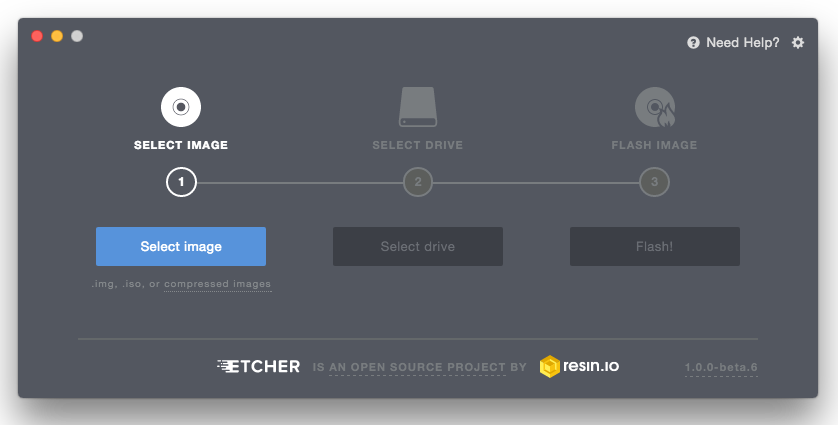

# Create the bootable media

The easiest way to install Linux Mint is with a USB stick.

If you cannot boot from USB, you can use a blank DVD.

### How to make a bootable USB stick[¶](broken-reference)

#### In Linux Mint[¶](broken-reference)

Right-click the ISO file and select Make Bootable USB Stick, or launch Menu ‣ Accessories ‣ USB Image Writer.

Select your USB device and click Write.

#### In Windows, Mac OS, or other Linux distributions[¶](broken-reference)

Download [Etcher](https://www.balena.io/etcher/), install it and run it.

Using Etcher

Click Select image and select your ISO file.

Click Select drive and select your USB stick.

Click Flash!.

### How to make a bootable DVD[¶](broken-reference)

Optical discs are slow and burning to disc is prone to errors.

Note

To prevent issues, burn at the lowest possible speed.

Warning

Burn the content of the ISO onto the DVD, not the ISO file itself. When finished, your DVD should contain directories such as `boot` and `casper`, it shouldn’t be an empty DVD containing an .iso file.

#### In Linux[¶](broken-reference)

Install and use `xfburn`.

#### In Windows[¶](broken-reference)

Right-click the ISO file and select Burn disk image.

To make sure the ISO was burned without any errors, select Verify disc after burning.

#### In Mac OS[¶](broken-reference)

Right-click the ISO file and select Burn Disk Image to Disc.
