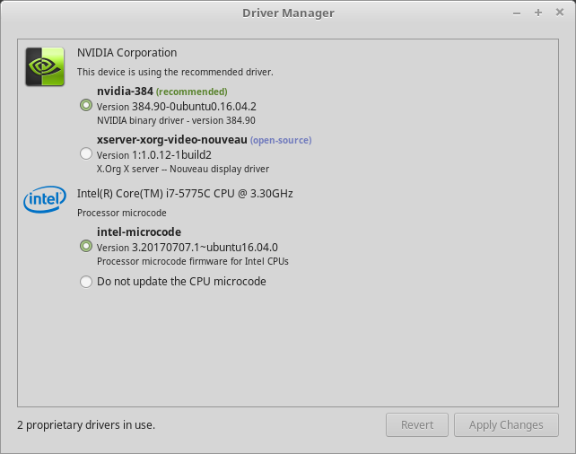

# Hardware drivers

* [Docs](broken-reference) »
* Hardware drivers
* [Edit on GitLab](https://gitlab.com/linuxmint/documentation/installation-guide/blob/master/docs/drivers.rst)

***

One of the first things to do after installing Linux Mint is to check for available hardware drivers.

1. Launch Menu ‣ Administration ‣ Driver Manager.

Hint

If you are offline, the Driver Manager will complain that it cannot connect to the Internet.

Insert your bootable Linux Mint USB stick (or DVD), wait for it to be mounted, and click OK.

2. Tick the appropriate checkboxes to select the available drivers and click Apply Changes.
3. Restart the computer.
