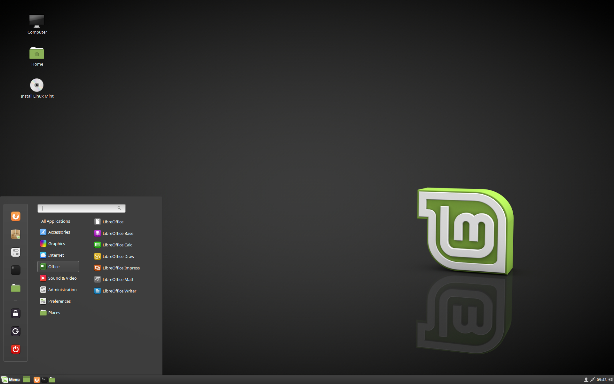

# Install Linux Mint

### The live session[¶](broken-reference)

When you boot the computer from the USB stick (or DVD), Linux Mint starts a `live session`. It logs you in automatically as a user called `mint` and shows you a desktop with the installer on it:

The Linux Mint live session

The `live session` is similar to a normal session (i.e. to Linux Mint once it is permanently installed on the computer), but with the following exceptions:

* The Live session is slower (it is loaded from a USB stick or DVD as opposed to a SSD or HDD).
* Changes you make in the live session are not permanent. They are not written to the USB stick (or DVD) and they do not impact the system installed by the installer.
* Some applications work differently (or not at all) in the live session (Timeshift, Flatpak, Update Manager, Welcome Screen..etc.).

Hint

The username for the live session is `mint`. If asked for a password press Enter.

### Installing Linux Mint on the computer[¶](broken-reference)

To permanently install Linux Mint on your computer:

1. Double-click Install Linux Mint.
2. Select your language.

3. Connect to the Internet.

4. If you are connected to the Internet, tick the box to install the multimedia codecs.

5. Choose an installation type.

If Linux Mint is the only operating system you want to run on this computer and all data can be lost on the hard drive, choose Erase disk and install Linux Mint.

Warning

Encrypt the new Linux Mint installation for security refers to full disk encryption. At this stage of the installation your keyboard layout wasn’t yet selected so it is set to en\_US. If you decide to use this option, keep this in mind when entering a password. Note that there are issues with this option and some NVIDIA drivers. If you are new to Linux use home directory encryption instead (you can select it later during the installation).

If another operating system is present on the computer, the installer shows you an option to install Linux Mint alongside it. If you choose this option, the installer automatically resizes your existing operating system, makes room and installs Linux Mint beside it. A boot menu is set up to choose between the two operating systems each time you start your computer.

Note

If you want to manage the partitions or specify which partitions to use, select Something else.

Linux Mint requires one partition to be mounted on the root `/` directory.

The Linux Mint operating system (without additional software or personal data) takes roughly 15GB, so give this partition a decent size (100GB or more).

`ext4` is recommended. It is the most popular Linux filesystem.

Also create a `swap` partition. This partition is used for hibernation and as a safety buffer in case your computer runs out of RAM. Give this partition a size equal to the amount of RAM in your computer.

6. Select your timezone

7. Select your keyboard layout

8. Enter your user details

Your `name` can be your real name, but it doesn’t have to be. It is only used locally, in the screensaver and on the login screen.

Your `username` is what you log in as, and your `hostname` is the name of your computer on the network.

To prevent bugs only use lowercase characters, with no punctuation or accentuation.

To protect your personal data against local attacks (people around you, or in case your computer gets stolen), tick Encrypt my home folder.

Choose a strong password.

9. Enjoy the slideshow while Linux Mint is installed on your computer.

When the installation is finished, click Restart Now.

The computer will then start to shut down and ask you to remove the USB disk (or DVD). Upon reboot, your computer should show you a boot menu or start your newly installed Linux Mint operating system.
