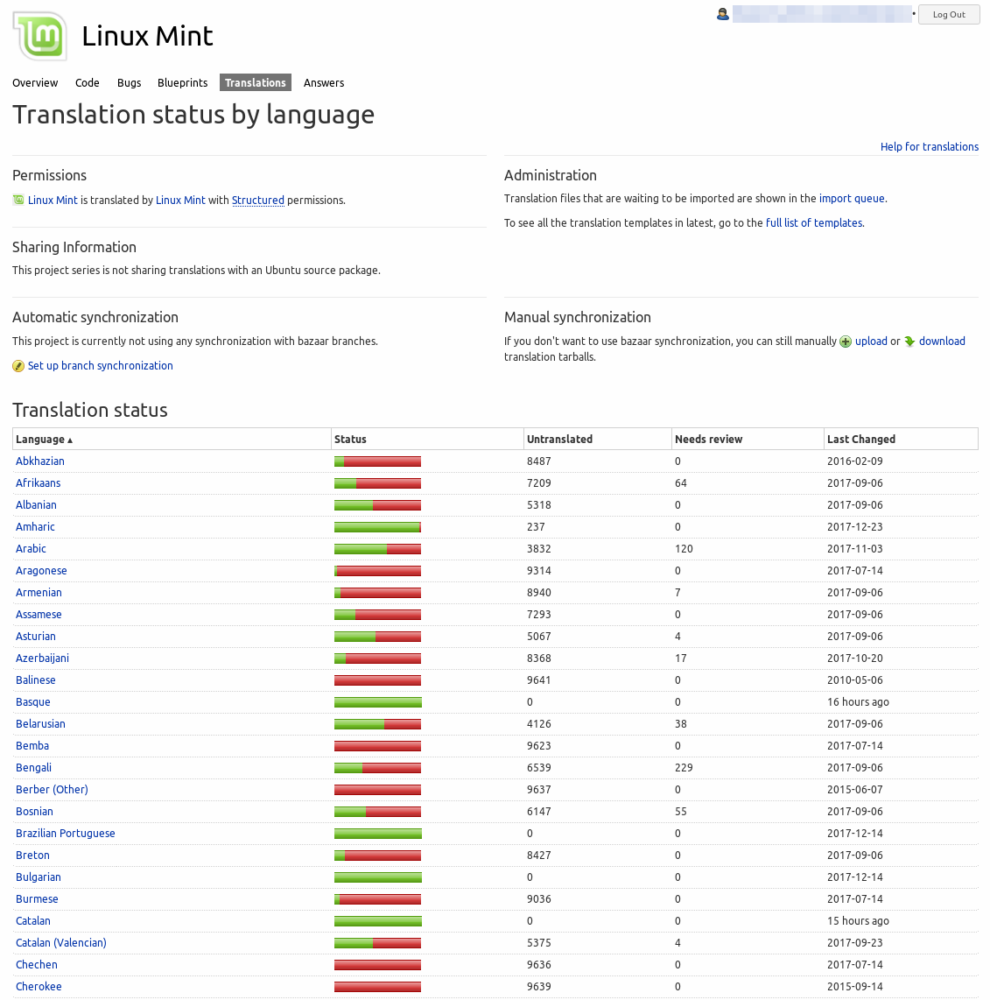
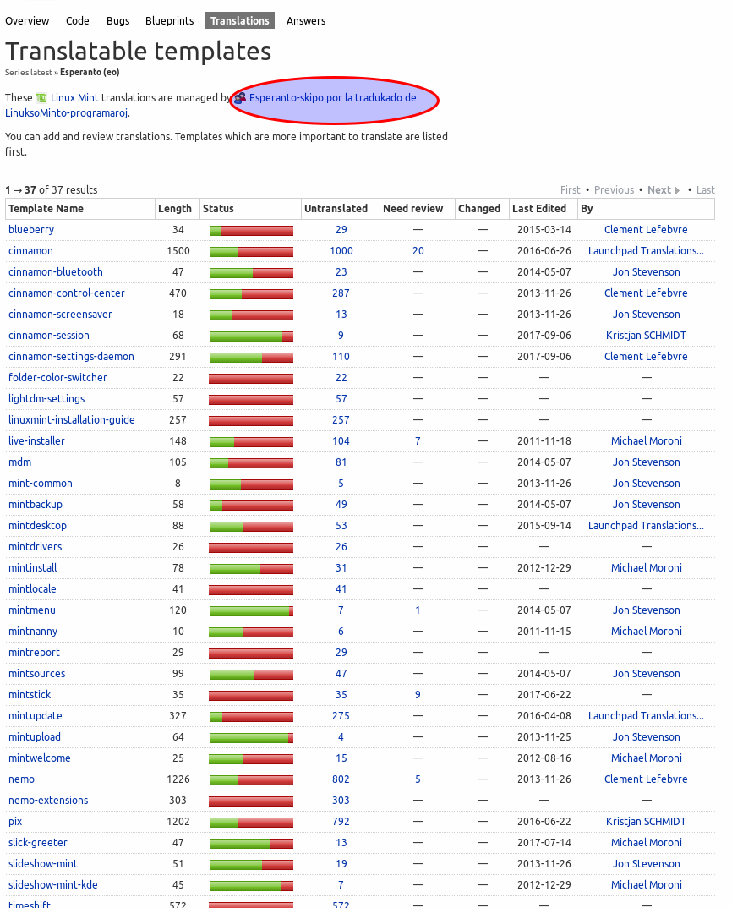
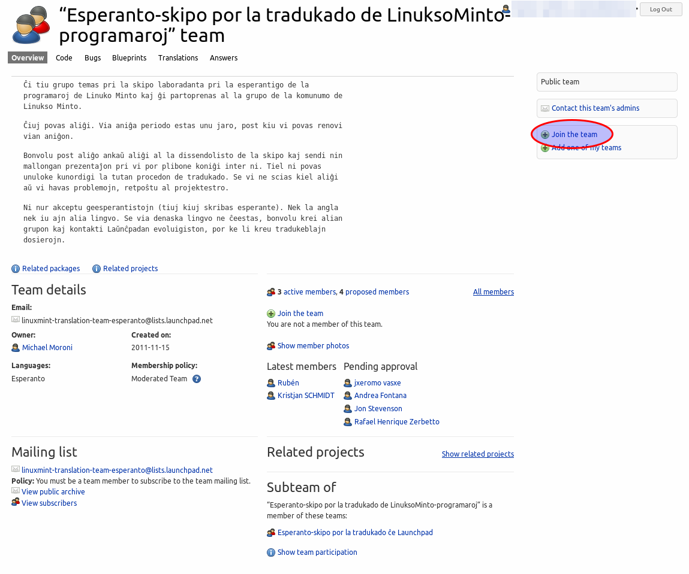
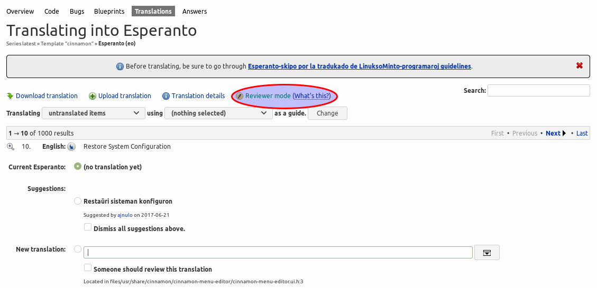
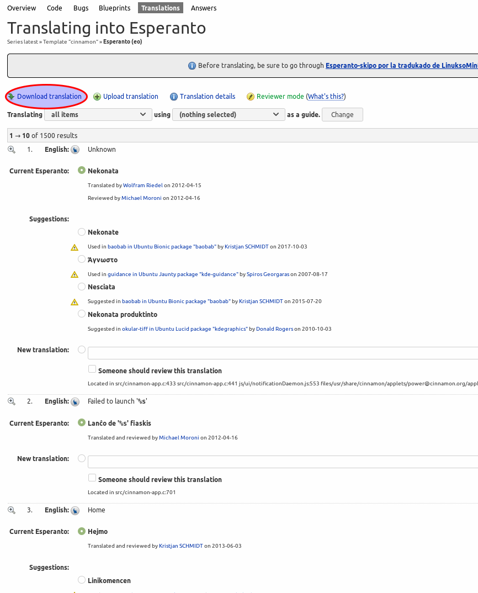
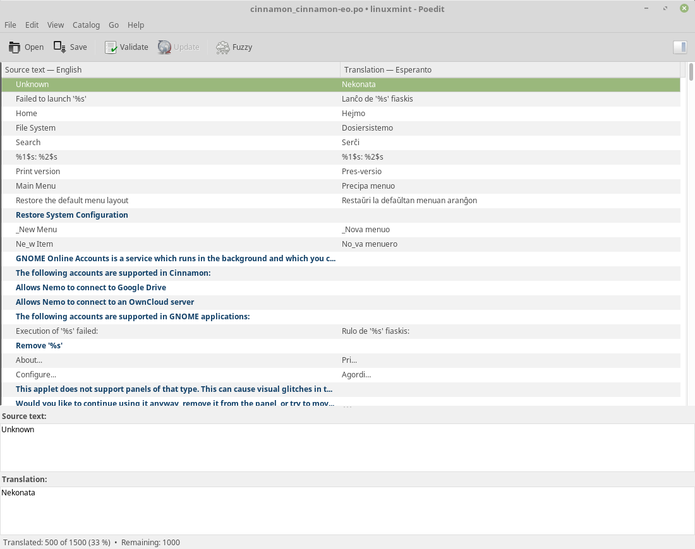
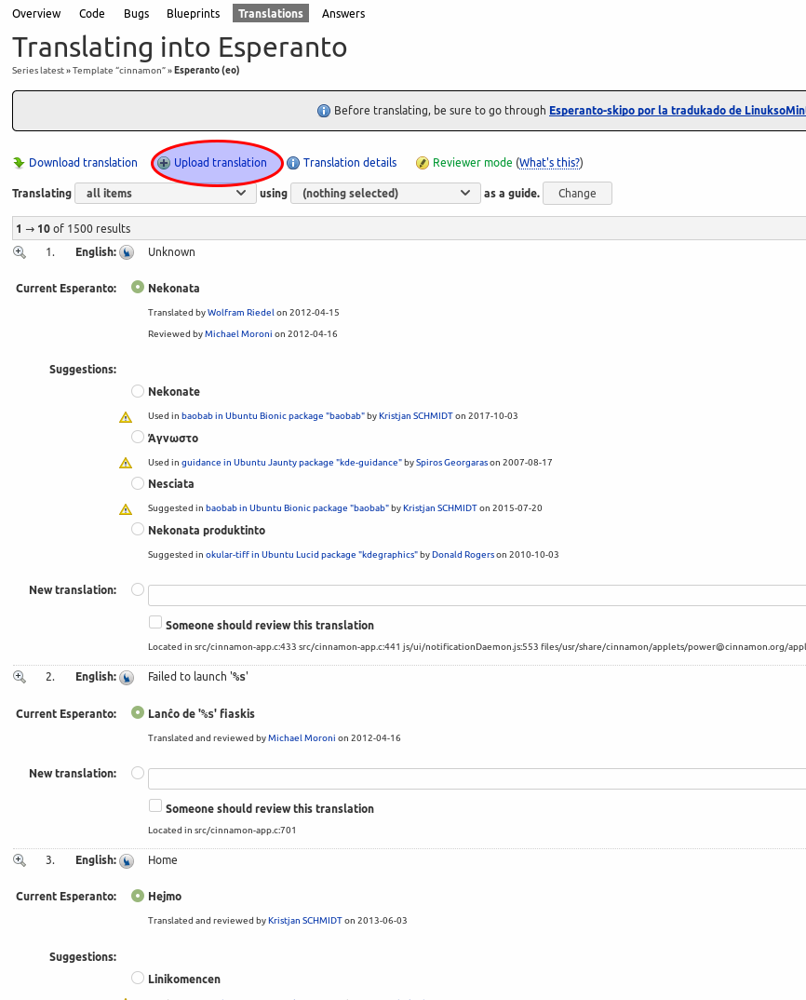

# Using Launchpad

### Create a Launchpad account[¶](broken-reference)

If you don’t have a Launchpad account already, use the [registration page](https://login.launchpad.net/+login) to create a new one.

Edit the languages for your account and add all the languages you are fluent in.

### Join the translation team for your language[¶](broken-reference)

To see all the languages and their current status, go to [Translation status by language](https://translations.launchpad.net/linuxmint/latest/) and click on View all languages.

Click on your language and then on the name of the team which is responsible for translations in your language:

Click Join the team:

### Translate using Launchpad[¶](broken-reference)

Once you’ve joined the translation team, you can start translating.

Click on your language, choose a project which has missing translations and click on the number of untranslated items.

At the top of the page, make sure that you are in `Reviewer mode` (otherwise your translations won’t be approved automatically and they will wait for somebody else to review them).

### Using POEdit[¶](broken-reference)

If you want to translate faster, you can download the translations as a `.po` file, edit that file with a tool called `poedit` and upload the edited `.po` file back into `Launchpad`.

### Download the translations[¶](broken-reference)

Choose a project and click Download translation:

Choose `PO format` as the file format and click Request Download.

Wait for Launchpad to send you an email (this can take a little while). In the email you will find a download link to either the `.po` file directly or a compressed archive containing the `.po` file.

### Use POEdit[¶](broken-reference)

To install POEdit, open a terminal and type:

Open the `.po` file you got from Launchpad with POEdit:

Browse the menus and familiarize yourself with the keyboard shortcuts. If you use these shortcuts and the built-in spell checker, you’ll translate much faster with POEdit than with Launchpad.

When finished, click Save.

### Upload the translations back into Launchpad[¶](broken-reference)

In Launchpad, click Upload translation.

Select your `.po` file and click Upload.

Click `Translation Import Queue` to view the [Translation import queue for latest](https://translations.launchpad.net/linuxmint/latest/+imports). If your upload is marked as `Needs Review`, click the `Edit` button (symbolized by a pen symbol), choose the correct template (i.e. project), and click `Approve`.
