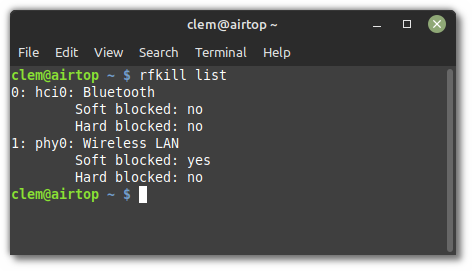

# Bluetooth

[Linux Mint User Guide](broken-reference)

### Enabling/disabling Bluetooth[¶](broken-reference)

#### Rfkill[¶](broken-reference)

Bluetooth can be disabled by using a software kill switch.

On some laptops, a hardware kill switch is also provided either via a special function key or key combination or a dedicated physical button or mechanism.

Using the _rfkill_ command, you can see the state of these switches.

Open a terminal and type:

The output lists the state of software and hardware kill switches for all your wireless devices:



In the picture above you can see that Bluetooth is neither _Soft blocked_ nor _Hard blocked_ and is therefore enabled.

You can use rfkill to block (i.e. disable) or unblock (i.e. enable) bluetooth:

```
rfkill block bluetooth
rfkill unblock bluetooth
```

#### Blueman[¶](broken-reference)

Blueman is the default Bluetooth Manager in Linux Mint.

It provides the little Bluetooth icon in your system tray.

To disable Bluetooth right-click the tray icon and select _Turn Bluetooth Off_.

To enable Bluetooth right-click the tray icon and select _Turn Bluetooth On_.

The very first time you open Blueman it asks if Bluetooth should be enabled automatically.

To check whether this feature is enabled open a terminal and type:

```
gsettings get org.blueman.plugins.powermanager auto-power-on
```

It _auto-power-on_ is set to _true_, Blueman automatically unblocks Bluetooth at startup.

If you want to persistently disable Bluetooth you need to set _auto-power-on_ to _false_:

```
gsettings set org.blueman.plugins.powermanager auto-power-on false
```

Note

The _auto-power-on_ option was recently removed in Blueman’s master branch. It’s still present in Blueman 2.3.2 but it’s likely to disappear in newer versions.

#### Systemd-rfkill[¶](broken-reference)

Systemd provides a service which saves the state of your kill switches during shutdown and restores them on the next boot.

This service is a core part of systemd and is installed in Linux Mint by default.

Note

Blueman runs after systemd-rfkill, so if Blueman’s _auto-power-on_ setting is enabled it overrides systemd-rfkill.

#### Bluez[¶](broken-reference)

Bluez is the Bluetooth stack used by Blueman.

Bluez has a setting called _AutoEnable_ in the file _/etc/bluetooth/main.conf_.

If you don’t want Bluez to automatically enable Bluetooth during boot set this option to false.
