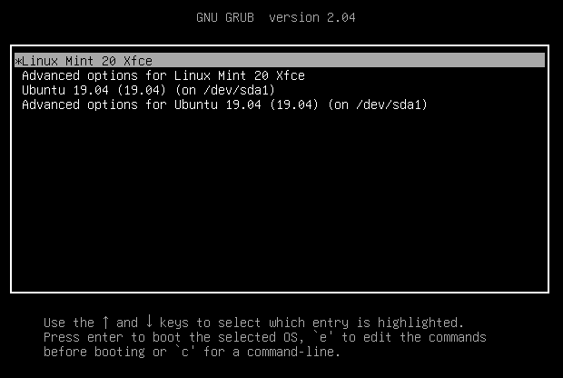

# Grub Boot Menu

* [Docs](broken-reference) »
* Grub Boot Menu
* [Edit on GitHub](https://github.com/linuxmint/doc-user-guide/blob/master/docs/grub.rst)

***

Grub is the boot menu.

If you have more than one operating system installed, it allows you to select which one to boot.

Grub is also useful for troubleshooting. You can use it to modify the boot arguments or to boot from an older kernel.

### How to make the Grub menu always visible[¶](broken-reference)

If you only run Linux Mint and there are no other operating systems on the computer, the menu is hidden by default.

To make it visible, as root, add these lines to _/etc/default/grub.d/90\_custom.cfg_:

```
GRUB_TIMEOUT="5"
GRUB_TIMEOUT_STYLE="menu"
```

Then type the following commands in a terminal:

### How to theme the Grub menu[¶](broken-reference)

For compatibility reasons, some releases sometimes ship without a Grub theme:



You can make it look like this:


To do so, open a terminal and type:

```
apt install --reinstall -o Dpkg::Options::="--force-confmiss" grub2-theme-mint
```

Or if you have a HiDPI screen, type this instead:

```
apt install --reinstall -o Dpkg::Options::="--force-confmiss" grub2-theme-mint-2k
```
