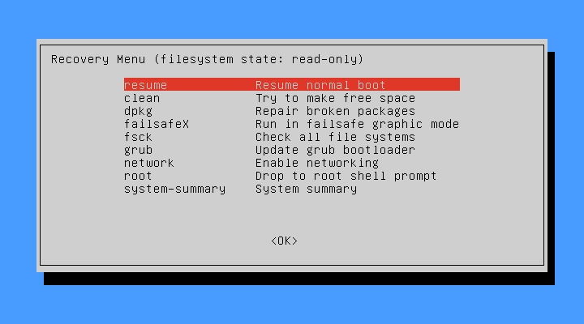
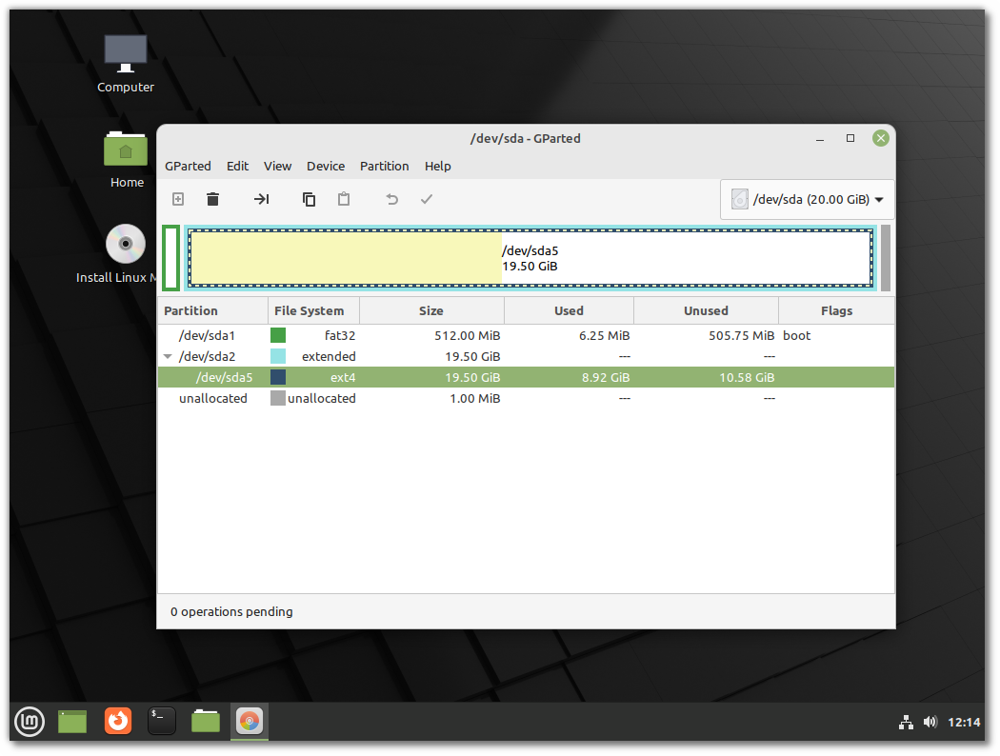

# Lost Password

Warning

If your disk is encrypted it is not possible to reset the password. If your home directory is encrypted changing your login password won’t help. Unless you made a backup of your encryption passphrase it is not possible to access the files.

If you forgot your password, and neither your partition nor your home directory are encrypted, there are two ways to reset it:

* Recovery mode
* Chroot from live ISO

### Recovery Mode[¶](broken-reference)

Boot up the computer, and after the BIOS screen, hold down the left Shift key to force the boot menu to show up:


Note

On some computers you might need to press the Escape key instead.

Select the second entry from the top, the one that starts with _Advanced options_.

Then on the next screen, select the second entry again, the one that ends with _(recovery mode)_.

Linux Mint will then starts in recovery mode and present this menu:



Select _root_ to get a root prompt and press Enter.

Use the passwd command to reset your password. Say your username is _joe_, type:

### Chroot from Live ISO[¶](broken-reference)

Boot up the computer from the live ISO.

Once in the live session launch _Gparted_ from the applications menu.



Identify your Linux Mint partition (usually a large ext4 partition). In the example above the Linux Mint partition is _/dev/sda5_.

Open a terminal and type the following commands:

```
mkdir hdd
sudo mount /dev/sda5 hdd
sudo chroot hdd
mount -o remount,rw /
passwd joe
```

Replace _/dev/sda5_ with your Mint partition and _joe_ with your username.

### Forgotten username[¶](broken-reference)

If you can’t remember your username type the following command, either in the chroot prompt or the recovery mode prompt:

This command lists the directories in /home which usually corresponds to the list of usernames on the OS.
