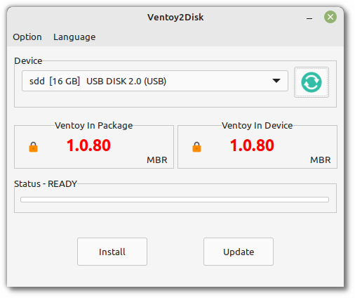

# Windows ISOs and multiboot USB

[Linux Mint User Guide](broken-reference)

Whether you want to make a USB stick which can boot multiple ISOs or simply boot from a Windows ISO image, we recommend using Ventoy.

### Ventoy[¶](broken-reference)

Ventoy is an open source tool which creates a special USB stick.

That stick contains an exFAT partition in which you can copy multiple ISO files and an EFI partition where Ventoy puts its bootable menu.

When you boot on the Ventoy USB stick, the menu lists all the ISOs you placed in the exFat partition and you can boot any of them.

#### Installation[¶](broken-reference)

Go to the [Ventoy release page](https://github.com/ventoy/Ventoy/releases) to find the latest version of Ventoy.

Download the _tar.gz_ archive and decompress it.

Right-click the decompressed ventoy folder and choose _Open in terminal_.

Run the following command to start Ventoy:

#### Using Ventoy[¶](broken-reference)

Choose the device which corresponds to your USB stick.

Press the _Install_ button.

Once Ventoy is installed, your USB stick should now be called _ventoy_.

Mount it if’s not already mounted.

Copy ISO files to the stick.

Boot on the Ventoy USB stick.

The ISOs you copied should appear as bootable options.
