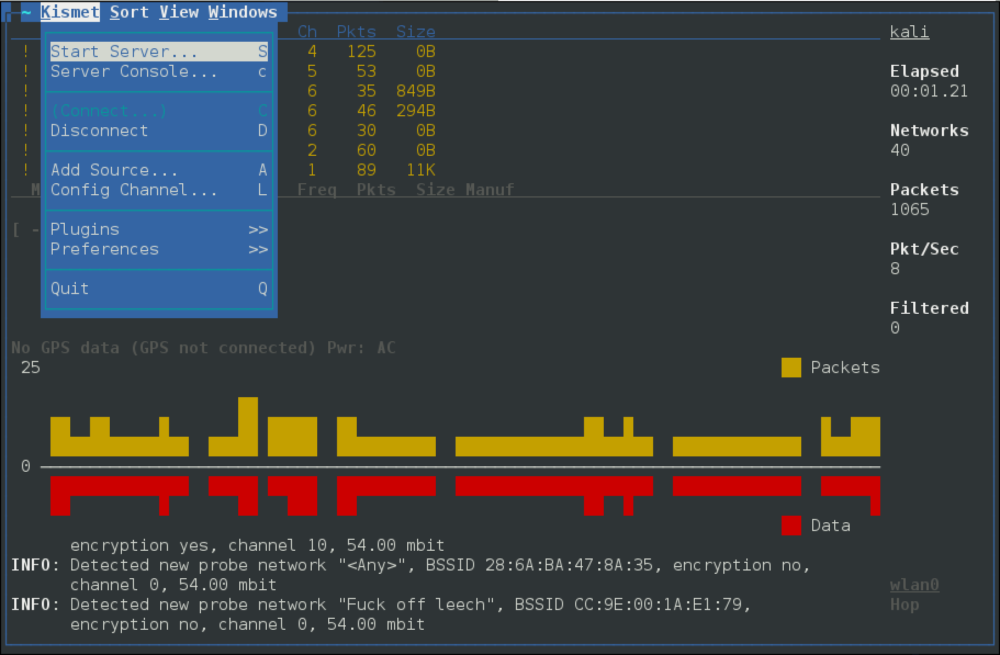

# 🌐 kismet

Kismet is a powerful security tool designed to detect, monitor and analyze wireless networks. It is an open-source tool, available on multiple platforms, including Linux, Windows, and macOS, and provides a comprehensive suite of features for wireless network security analysis.

Kismet can be used to detect a wide range of wireless network protocols, including Wi-Fi, Bluetooth, ZigBee, and many others. It has a powerful packet capture engine that can capture and decode wireless network packets in real-time, allowing security professionals to identify vulnerabilities and potential attacks. Additionally, it can also identify and locate rogue access points that may be used for malicious purposes.

One of the key features of Kismet is its ability to track and log wireless network activity. It can store data on all detected wireless networks, including information about the devices connected to them and the packets being transmitted. This data can be used for analysis, identifying patterns and trends, and detecting potential security threats.

Kismet also provides advanced visualization tools, allowing security professionals to view wireless network activity in real-time. It includes a range of visualizations, including heat maps, graphs, and charts, which can be used to identify areas of network congestion, potential security risks, and other issues.

Another important feature of Kismet is its ability to support multiple wireless network adapters simultaneously. This makes it possible to monitor and analyze multiple networks at the same time, providing a comprehensive view of wireless network activity across an organization.

Kismet also includes advanced security features, such as encryption and authentication support, to help ensure the security of wireless network traffic. It can also be used to test the security of wireless networks, including testing for vulnerabilities and weaknesses in network configurations.

Overall, Kismet is a powerful and flexible security tool that can provide organizations with comprehensive visibility and control over their wireless network security. Its open-source nature, combined with its broad range of features and ease of use, makes it a popular choice for security professionals and IT administrators alike.

### Screenshots <a href="#screenshots" id="screenshots"></a>

```
kismet
```

[](../../.gitbook/assets/kismet.png)

### kismet\_client <a href="#kismet_client" id="kismet_client"></a>

```
:~# kismet_client -h
Usage: kismet_client [OPTION]
 *** Generic Options ***
 -h, --help                   The obvious
```

### kismet\_drone <a href="#kismet_drone" id="kismet_drone"></a>

```
:~# kismet_drone -h
Usage: kismet_drone [OPTION]
Nearly all of these options are run-time overrides for values in the
kismet.conf configuration file.  Permanent changes should be made to
the configuration file.
 *** Generic Options ***
 -f, --config-file            Use alternate configuration file
     --no-line-wrap           Turn of linewrapping of output
                              (for grep, speed, etc)
 -s, --silent                 Turn off stdout output after setup phase
     --daemonize              Spawn detatched in the background

 *** Kismet Remote Drone Options ***
     --drone-listen           Override Kismet drone listen options

 *** Packet Capture Source Options ***
 -c, --capture-source         Specify a new packet capture source
                              (Identical syntax to the config file)
 -C, --enable-capture-sources Enable capture sources (comma-separated
                              list of names or interfaces)
```

### kismet\_server Usage Example <a href="#kismet_server-usage-example" id="kismet_server-usage-example"></a>

Start the Kismet server, using the wireless interface as the capture source (`-c wlan0`) and use the external GPSD option (`–use-gpsd-gps`):

```
:~# kismet_server -c wlan0 --use-gpsd-gps
ERROR: Kismet was started as root, NOT launching external control binary.
       This is NOT the preferred method of starting Kismet as Kismet will
       continue to run as root the entire time.  Please read the README
       file section about Installation & Security and be sure this is what
       you want to do.
INFO: Reading from config file /etc/kismet/kismet.conf
INFO: No 'dronelisten' config line and no command line drone-listen
      argument given, Kismet drone server will not be enabled.
INFO: Created alert tracker...
INFO: Creating device tracker...
INFO: Registered 80211 PHY as id
```

***

\


### Packages and Binaries:

#### kismet <a href="#kismet" id="kismet"></a>

Kismet is a wireless network and device detector, sniffer, wardriving tool, and WIDS (wireless intrusion detection) framework.

Kismet works with Wi-Fi interfaces, Bluetooth interfaces, some SDR (software defined radio) hardware like the RTLSDR, and other specialized capture hardware.

This is a metapackage containing the kismet tools.

**Installed size:** `24 KB`\
**How to install:** `sudo apt install kismet`

<details>

<summary>Dependencies:</summary>

* kismet-capture-linux-bluetooth
* kismet-capture-linux-wifi
* kismet-capture-nrf-51822
* kismet-capture-nrf-52840
* kismet-capture-nrf-mousejack
* kismet-capture-nxp-kw41z
* kismet-capture-rz-killerbee
* kismet-capture-ti-cc-2531
* kismet-capture-ti-cc-2540
* kismet-capture-ubertooth-one
* kismet-core
* kismet-logtools
* python3-kismetcapturebtgeiger
* python3-kismetcapturefreaklabszigbee
* python3-kismetcapturertl433
* python3-kismetcapturertladsb
* python3-kismetcapturertlamr

</details>

***

#### kismet-capture-common <a href="#kismet-capture-common" id="kismet-capture-common"></a>

Kismet is a wireless network and device detector, sniffer, wardriving tool, and WIDS (wireless intrusion detection) framework.

Kismet works with Wi-Fi interfaces, Bluetooth interfaces, some SDR (software defined radio) hardware like the RTLSDR, and other specialized capture hardware.

This package contains the debconf files for setuid capture binaries.

**Installed size:** `43 KB`\
**How to install:** `sudo apt install kismet-capture-common`

<details>

<summary>Dependencies:</summary>

* adduser
* debconf | debconf-2.0

</details>

***

#### kismet-capture-linux-bluetooth <a href="#kismet-capture-linux-bluetooth" id="kismet-capture-linux-bluetooth"></a>

Kismet is a wireless network and device detector, sniffer, wardriving tool, and WIDS (wireless intrusion detection) framework.

Kismet works with Wi-Fi interfaces, Bluetooth interfaces, some SDR (software defined radio) hardware like the RTLSDR, and other specialized capture hardware.

This package contains the Kismet Linux Bluetooth capture helper.

**Installed size:** `177 KB`\
**How to install:** `sudo apt install kismet-capture-linux-bluetooth`

<details>

<summary>Dependencies:</summary>

* debconf | debconf-2.0
* kismet-capture-common
* libc6
* libprotobuf-c1
* libwebsockets17

</details>

**kismet\_cap\_linux\_bluetooth**

```
:~# kismet_cap_linux_bluetooth -h
kismet_cap_linux_bluetooth is a capture driver for Kismet.  Typically it is started
automatically by the Kismet server.

kismet_cap_linux_bluetooth supports sending data to a remote Kismet server
usage: kismet_cap_linux_bluetooth [options]
 --connect [host]:[port]      Connect to remote Kismet server on [host] and [port]; by
                               default this now uses the new websockets interface built
                               into the Kismet webserver on port 2501; to connect using
                               the legacy remote capture protocol, specify the '--tcp'
                               option and the appropriate port, by default port 3501.
 --tcp                        Use the legacy TCP remote capture protocol, when combined
                               with the --connect option.  The modern protocol uses 
                               websockets built into the Kismet server and does not
                               need this option.
 --ssl                        Use SSL to connect to a websocket-enabled Kismet server
 --ssl-certificate [certfile] Use SSL to connect to a websocket-enabled Kismet server
                               and use the provided certificate authority certificate
                               to validate the server.
 --user [username]            Kismet username for a websockets-based remote capture
                               source.  A username and password, or an API key, are
                               required for websockets mode.  A username and password
                               are ONLY used in websockets mode.
 --password [password]        Kismet password for a websockets-based remote capture source.
                               A username and password, or an API key, are required for
                               websocket mode.  A username and password are ONLY used in
                               websockets mode.
 --apikey [api key]           A Kismet API key for the 'datasource' role; this may be
                               supplied instead of a username and password for websockets
                               based remote capture.  An API key is ONLY used in websockets
                               mode.
 --endpoint [endpoint]        An alternate endpoint for the websockets connection.  By
                               default remote datasources are terminated at
                                 /datasource/remote/remotesource.ws
                               This should typically only be changed when using a HTTP proxy
                               homing the Kismet service under a directory.  Endpoints 
                               should include the full path to the websocket endpoint, for
                               example:
                                 --endpoint=/kismet/proxy/datasource/remote/remotesource.ws
 --source [source def]        Specify a source to send to the remote 
                              Kismet server; only used in conjunction with remote capture.
 --disable-retry              Do not attempt to reconnect to a remote server if there is an
                               error; exit immediately.  By default a remote capture will
                               attempt to reconnect indefinitely if the server is not
                               available.
 --fixed-gps [lat,lon,alt]    Set a fixed location for this capture (remote only),
                               accepts lat,lon,alt or lat,lon
 --gps-name [name]            Set an alternate GPS name for this source
 --daemonize                  Background the capture tool and enter daemon mode.
 --list                       List supported devices detected
 --autodetect [uuid:optional] Look for a Kismet server in announcement mode, optionally 
                              waiting for a specific server UUID to be seen.  Requires 
                              a Kismet server configured for announcement mode.
```

***

#### kismet-capture-linux-wifi <a href="#kismet-capture-linux-wifi" id="kismet-capture-linux-wifi"></a>

Kismet is a wireless network and device detector, sniffer, wardriving tool, and WIDS (wireless intrusion detection) framework.

Kismet works with Wi-Fi interfaces, Bluetooth interfaces, some SDR (software defined radio) hardware like the RTLSDR, and other specialized capture hardware.

This package contains the Kismet Linux Wi-Fi capture helper.

**Installed size:** `238 KB`\
**How to install:** `sudo apt install kismet-capture-linux-wifi`

<details>

<summary>Dependencies:</summary>

* debconf | debconf-2.0
* kismet-capture-common
* libc6
* libglib2.0-0
* libnl-3-200
* libnl-genl-3-200
* libnm0
* libpcap0.8
* libprotobuf-c1
* libwebsockets17

</details>

**kismet\_cap\_linux\_wifi**

```
:~# kismet_cap_linux_wifi -h
kismet_cap_linux_wifi is a capture driver for Kismet.  Typically it is started
automatically by the Kismet server.

kismet_cap_linux_wifi supports sending data to a remote Kismet server
usage: kismet_cap_linux_wifi [options]
 --connect [host]:[port]      Connect to remote Kismet server on [host] and [port]; by
                               default this now uses the new websockets interface built
                               into the Kismet webserver on port 2501; to connect using
                               the legacy remote capture protocol, specify the '--tcp'
                               option and the appropriate port, by default port 3501.
 --tcp                        Use the legacy TCP remote capture protocol, when combined
                               with the --connect option.  The modern protocol uses 
                               websockets built into the Kismet server and does not
                               need this option.
 --ssl                        Use SSL to connect to a websocket-enabled Kismet server
 --ssl-certificate [certfile] Use SSL to connect to a websocket-enabled Kismet server
                               and use the provided certificate authority certificate
                               to validate the server.
 --user [username]            Kismet username for a websockets-based remote capture
                               source.  A username and password, or an API key, are
                               required for websockets mode.  A username and password
                               are ONLY used in websockets mode.
 --password [password]        Kismet password for a websockets-based remote capture source.
                               A username and password, or an API key, are required for
                               websocket mode.  A username and password are ONLY used in
                               websockets mode.
 --apikey [api key]           A Kismet API key for the 'datasource' role; this may be
                               supplied instead of a username and password for websockets
                               based remote capture.  An API key is ONLY used in websockets
                               mode.
 --endpoint [endpoint]        An alternate endpoint for the websockets connection.  By
                               default remote datasources are terminated at
                                 /datasource/remote/remotesource.ws
                               This should typically only be changed when using a HTTP proxy
                               homing the Kismet service under a directory.  Endpoints 
                               should include the full path to the websocket endpoint, for
                               example:
                                 --endpoint=/kismet/proxy/datasource/remote/remotesource.ws
 --source [source def]        Specify a source to send to the remote 
                              Kismet server; only used in conjunction with remote capture.
 --disable-retry              Do not attempt to reconnect to a remote server if there is an
                               error; exit immediately.  By default a remote capture will
                               attempt to reconnect indefinitely if the server is not
                               available.
 --fixed-gps [lat,lon,alt]    Set a fixed location for this capture (remote only),
                               accepts lat,lon,alt or lat,lon
 --gps-name [name]            Set an alternate GPS name for this source
 --daemonize                  Background the capture tool and enter daemon mode.
 --list                       List supported devices detected
 --autodetect [uuid:optional] Look for a Kismet server in announcement mode, optionally 
                              waiting for a specific server UUID to be seen.  Requires 
                              a Kismet server configured for announcement mode.
```

***

#### kismet-capture-nrf-51822 <a href="#kismet-capture-nrf-51822" id="kismet-capture-nrf-51822"></a>

Kismet is a wireless network and device detector, sniffer, wardriving tool, and WIDS (wireless intrusion detection) framework.

Kismet works with Wi-Fi interfaces, Bluetooth interfaces, some SDR (software defined radio) hardware like the RTLSDR, and other specialized capture hardware.

This package contains the NRF51822 BTLE Sniffer capture helper.

**Installed size:** `165 KB`\
**How to install:** `sudo apt install kismet-capture-nrf-51822`

<details>

<summary>Dependencies:</summary>

* debconf | debconf-2.0
* kismet-capture-common
* libc6
* libprotobuf-c1
* libwebsockets17

</details>

**kismet\_cap\_nrf\_51822**

```
:~# kismet_cap_nrf_51822 -h
kismet_cap_nrf_51822 is a capture driver for Kismet.  Typically it is started
automatically by the Kismet server.

kismet_cap_nrf_51822 supports sending data to a remote Kismet server
usage: kismet_cap_nrf_51822 [options]
 --connect [host]:[port]      Connect to remote Kismet server on [host] and [port]; by
                               default this now uses the new websockets interface built
                               into the Kismet webserver on port 2501; to connect using
                               the legacy remote capture protocol, specify the '--tcp'
                               option and the appropriate port, by default port 3501.
 --tcp                        Use the legacy TCP remote capture protocol, when combined
                               with the --connect option.  The modern protocol uses 
                               websockets built into the Kismet server and does not
                               need this option.
 --ssl                        Use SSL to connect to a websocket-enabled Kismet server
 --ssl-certificate [certfile] Use SSL to connect to a websocket-enabled Kismet server
                               and use the provided certificate authority certificate
                               to validate the server.
 --user [username]            Kismet username for a websockets-based remote capture
                               source.  A username and password, or an API key, are
                               required for websockets mode.  A username and password
                               are ONLY used in websockets mode.
 --password [password]        Kismet password for a websockets-based remote capture source.
                               A username and password, or an API key, are required for
                               websocket mode.  A username and password are ONLY used in
                               websockets mode.
 --apikey [api key]           A Kismet API key for the 'datasource' role; this may be
                               supplied instead of a username and password for websockets
                               based remote capture.  An API key is ONLY used in websockets
                               mode.
 --endpoint [endpoint]        An alternate endpoint for the websockets connection.  By
                               default remote datasources are terminated at
                                 /datasource/remote/remotesource.ws
                               This should typically only be changed when using a HTTP proxy
                               homing the Kismet service under a directory.  Endpoints 
                               should include the full path to the websocket endpoint, for
                               example:
                                 --endpoint=/kismet/proxy/datasource/remote/remotesource.ws
 --source [source def]        Specify a source to send to the remote 
                              Kismet server; only used in conjunction with remote capture.
 --disable-retry              Do not attempt to reconnect to a remote server if there is an
                               error; exit immediately.  By default a remote capture will
                               attempt to reconnect indefinitely if the server is not
                               available.
 --fixed-gps [lat,lon,alt]    Set a fixed location for this capture (remote only),
                               accepts lat,lon,alt or lat,lon
 --gps-name [name]            Set an alternate GPS name for this source
 --daemonize                  Background the capture tool and enter daemon mode.
 --list                       List supported devices detected
 --autodetect [uuid:optional] Look for a Kismet server in announcement mode, optionally 
                              waiting for a specific server UUID to be seen.  Requires 
                              a Kismet server configured for announcement mode.
```

***

#### kismet-capture-nrf-52840 <a href="#kismet-capture-nrf-52840" id="kismet-capture-nrf-52840"></a>

Kismet is a wireless network and device detector, sniffer, wardriving tool, and WIDS (wireless intrusion detection) framework.

Kismet works with Wi-Fi interfaces, Bluetooth interfaces, some SDR (software defined radio) hardware like the RTLSDR, and other specialized capture hardware.

This package contains the NRF52840 BTLE Sniffer capture helper.

**Installed size:** `165 KB`\
**How to install:** `sudo apt install kismet-capture-nrf-52840`

<details>

<summary>Dependencies:</summary>

* debconf | debconf-2.0
* kismet-capture-common
* libc6
* libprotobuf-c1
* libwebsockets17

</details>

**kismet\_cap\_nrf\_52840**

```
:~# kismet_cap_nrf_52840 -h
kismet_cap_nrf_52840 is a capture driver for Kismet.  Typically it is started
automatically by the Kismet server.

kismet_cap_nrf_52840 supports sending data to a remote Kismet server
usage: kismet_cap_nrf_52840 [options]
 --connect [host]:[port]      Connect to remote Kismet server on [host] and [port]; by
                               default this now uses the new websockets interface built
                               into the Kismet webserver on port 2501; to connect using
                               the legacy remote capture protocol, specify the '--tcp'
                               option and the appropriate port, by default port 3501.
 --tcp                        Use the legacy TCP remote capture protocol, when combined
                               with the --connect option.  The modern protocol uses 
                               websockets built into the Kismet server and does not
                               need this option.
 --ssl                        Use SSL to connect to a websocket-enabled Kismet server
 --ssl-certificate [certfile] Use SSL to connect to a websocket-enabled Kismet server
                               and use the provided certificate authority certificate
                               to validate the server.
 --user [username]            Kismet username for a websockets-based remote capture
                               source.  A username and password, or an API key, are
                               required for websockets mode.  A username and password
                               are ONLY used in websockets mode.
 --password [password]        Kismet password for a websockets-based remote capture source.
                               A username and password, or an API key, are required for
                               websocket mode.  A username and password are ONLY used in
                               websockets mode.
 --apikey [api key]           A Kismet API key for the 'datasource' role; this may be
                               supplied instead of a username and password for websockets
                               based remote capture.  An API key is ONLY used in websockets
                               mode.
 --endpoint [endpoint]        An alternate endpoint for the websockets connection.  By
                               default remote datasources are terminated at
                                 /datasource/remote/remotesource.ws
                               This should typically only be changed when using a HTTP proxy
                               homing the Kismet service under a directory.  Endpoints 
                               should include the full path to the websocket endpoint, for
                               example:
                                 --endpoint=/kismet/proxy/datasource/remote/remotesource.ws
 --source [source def]        Specify a source to send to the remote 
                              Kismet server; only used in conjunction with remote capture.
 --disable-retry              Do not attempt to reconnect to a remote server if there is an
                               error; exit immediately.  By default a remote capture will
                               attempt to reconnect indefinitely if the server is not
                               available.
 --fixed-gps [lat,lon,alt]    Set a fixed location for this capture (remote only),
                               accepts lat,lon,alt or lat,lon
 --gps-name [name]            Set an alternate GPS name for this source
 --daemonize                  Background the capture tool and enter daemon mode.
 --list                       List supported devices detected
 --autodetect [uuid:optional] Look for a Kismet server in announcement mode, optionally 
                              waiting for a specific server UUID to be seen.  Requires 
                              a Kismet server configured for announcement mode.
```

***

#### kismet-capture-nrf-mousejack <a href="#kismet-capture-nrf-mousejack" id="kismet-capture-nrf-mousejack"></a>

Kismet is a wireless network and device detector, sniffer, wardriving tool, and WIDS (wireless intrusion detection) framework.

Kismet works with Wi-Fi interfaces, Bluetooth interfaces, some SDR (software defined radio) hardware like the RTLSDR, and other specialized capture hardware.

This package contains the Kismet nRF MouseJack capture helper.

**Installed size:** `169 KB`\
**How to install:** `sudo apt install kismet-capture-nrf-mousejack`

<details>

<summary>Dependencies:</summary>

* debconf | debconf-2.0
* kismet-capture-common
* libc6
* libprotobuf-c1
* libusb-1.0-0
* libwebsockets17

</details>

**kismet\_cap\_nrf\_mousejack**

```
:~# kismet_cap_nrf_mousejack -h
kismet_cap_nrf_mousejack is a capture driver for Kismet.  Typically it is started
automatically by the Kismet server.

kismet_cap_nrf_mousejack supports sending data to a remote Kismet server
usage: kismet_cap_nrf_mousejack [options]
 --connect [host]:[port]      Connect to remote Kismet server on [host] and [port]; by
                               default this now uses the new websockets interface built
                               into the Kismet webserver on port 2501; to connect using
                               the legacy remote capture protocol, specify the '--tcp'
                               option and the appropriate port, by default port 3501.
 --tcp                        Use the legacy TCP remote capture protocol, when combined
                               with the --connect option.  The modern protocol uses 
                               websockets built into the Kismet server and does not
                               need this option.
 --ssl                        Use SSL to connect to a websocket-enabled Kismet server
 --ssl-certificate [certfile] Use SSL to connect to a websocket-enabled Kismet server
                               and use the provided certificate authority certificate
                               to validate the server.
 --user [username]            Kismet username for a websockets-based remote capture
                               source.  A username and password, or an API key, are
                               required for websockets mode.  A username and password
                               are ONLY used in websockets mode.
 --password [password]        Kismet password for a websockets-based remote capture source.
                               A username and password, or an API key, are required for
                               websocket mode.  A username and password are ONLY used in
                               websockets mode.
 --apikey [api key]           A Kismet API key for the 'datasource' role; this may be
                               supplied instead of a username and password for websockets
                               based remote capture.  An API key is ONLY used in websockets
                               mode.
 --endpoint [endpoint]        An alternate endpoint for the websockets connection.  By
                               default remote datasources are terminated at
                                 /datasource/remote/remotesource.ws
                               This should typically only be changed when using a HTTP proxy
                               homing the Kismet service under a directory.  Endpoints 
                               should include the full path to the websocket endpoint, for
                               example:
                                 --endpoint=/kismet/proxy/datasource/remote/remotesource.ws
 --source [source def]        Specify a source to send to the remote 
                              Kismet server; only used in conjunction with remote capture.
 --disable-retry              Do not attempt to reconnect to a remote server if there is an
                               error; exit immediately.  By default a remote capture will
                               attempt to reconnect indefinitely if the server is not
                               available.
 --fixed-gps [lat,lon,alt]    Set a fixed location for this capture (remote only),
                               accepts lat,lon,alt or lat,lon
 --gps-name [name]            Set an alternate GPS name for this source
 --daemonize                  Background the capture tool and enter daemon mode.
 --list                       List supported devices detected
 --autodetect [uuid:optional] Look for a Kismet server in announcement mode, optionally 
                              waiting for a specific server UUID to be seen.  Requires 
                              a Kismet server configured for announcement mode.
```

***

#### kismet-capture-nxp-kw41z <a href="#kismet-capture-nxp-kw41z" id="kismet-capture-nxp-kw41z"></a>

Kismet is a wireless network and device detector, sniffer, wardriving tool, and WIDS (wireless intrusion detection) framework.

Kismet works with Wi-Fi interfaces, Bluetooth interfaces, some SDR (software defined radio) hardware like the RTLSDR, and other specialized capture hardware.

This package contains the Kismet NXP KW41Z BTLE and Zigbee Sniffer capture helper.

**Installed size:** `169 KB`\
**How to install:** `sudo apt install kismet-capture-nxp-kw41z`

<details>

<summary>Dependencies:</summary>

* debconf | debconf-2.0
* kismet-capture-common
* libc6
* libprotobuf-c1
* libwebsockets17

</details>

**kismet\_cap\_nxp\_kw41z**

```
:~# kismet_cap_nxp_kw41z -h
kismet_cap_nxp_kw41z is a capture driver for Kismet.  Typically it is started
automatically by the Kismet server.

kismet_cap_nxp_kw41z supports sending data to a remote Kismet server
usage: kismet_cap_nxp_kw41z [options]
 --connect [host]:[port]      Connect to remote Kismet server on [host] and [port]; by
                               default this now uses the new websockets interface built
                               into the Kismet webserver on port 2501; to connect using
                               the legacy remote capture protocol, specify the '--tcp'
                               option and the appropriate port, by default port 3501.
 --tcp                        Use the legacy TCP remote capture protocol, when combined
                               with the --connect option.  The modern protocol uses 
                               websockets built into the Kismet server and does not
                               need this option.
 --ssl                        Use SSL to connect to a websocket-enabled Kismet server
 --ssl-certificate [certfile] Use SSL to connect to a websocket-enabled Kismet server
                               and use the provided certificate authority certificate
                               to validate the server.
 --user [username]            Kismet username for a websockets-based remote capture
                               source.  A username and password, or an API key, are
                               required for websockets mode.  A username and password
                               are ONLY used in websockets mode.
 --password [password]        Kismet password for a websockets-based remote capture source.
                               A username and password, or an API key, are required for
                               websocket mode.  A username and password are ONLY used in
                               websockets mode.
 --apikey [api key]           A Kismet API key for the 'datasource' role; this may be
                               supplied instead of a username and password for websockets
                               based remote capture.  An API key is ONLY used in websockets
                               mode.
 --endpoint [endpoint]        An alternate endpoint for the websockets connection.  By
                               default remote datasources are terminated at
                                 /datasource/remote/remotesource.ws
                               This should typically only be changed when using a HTTP proxy
                               homing the Kismet service under a directory.  Endpoints 
                               should include the full path to the websocket endpoint, for
                               example:
                                 --endpoint=/kismet/proxy/datasource/remote/remotesource.ws
 --source [source def]        Specify a source to send to the remote 
                              Kismet server; only used in conjunction with remote capture.
 --disable-retry              Do not attempt to reconnect to a remote server if there is an
                               error; exit immediately.  By default a remote capture will
                               attempt to reconnect indefinitely if the server is not
                               available.
 --fixed-gps [lat,lon,alt]    Set a fixed location for this capture (remote only),
                               accepts lat,lon,alt or lat,lon
 --gps-name [name]            Set an alternate GPS name for this source
 --daemonize                  Background the capture tool and enter daemon mode.
 --list                       List supported devices detected
 --autodetect [uuid:optional] Look for a Kismet server in announcement mode, optionally 
                              waiting for a specific server UUID to be seen.  Requires 
                              a Kismet server configured for announcement mode.
```

***

#### kismet-capture-rz-killerbee <a href="#kismet-capture-rz-killerbee" id="kismet-capture-rz-killerbee"></a>

Kismet is a wireless network and device detector, sniffer, wardriving tool, and WIDS (wireless intrusion detection) framework.

Kismet works with Wi-Fi interfaces, Bluetooth interfaces, some SDR (software defined radio) hardware like the RTLSDR, and other specialized capture hardware.

This package contains the Kismet Killerbee Sniffer capture helper.

**Installed size:** `169 KB`\
**How to install:** `sudo apt install kismet-capture-rz-killerbee`

<details>

<summary>Dependencies:</summary>

* debconf | debconf-2.0
* kismet-capture-common
* libc6
* libprotobuf-c1
* libusb-1.0-0
* libwebsockets17

</details>

**kismet\_cap\_rz\_killerbee**

```
:~# kismet_cap_rz_killerbee -h
kismet_cap_rz_killerbee is a capture driver for Kismet.  Typically it is started
automatically by the Kismet server.

kismet_cap_rz_killerbee supports sending data to a remote Kismet server
usage: kismet_cap_rz_killerbee [options]
 --connect [host]:[port]      Connect to remote Kismet server on [host] and [port]; by
                               default this now uses the new websockets interface built
                               into the Kismet webserver on port 2501; to connect using
                               the legacy remote capture protocol, specify the '--tcp'
                               option and the appropriate port, by default port 3501.
 --tcp                        Use the legacy TCP remote capture protocol, when combined
                               with the --connect option.  The modern protocol uses 
                               websockets built into the Kismet server and does not
                               need this option.
 --ssl                        Use SSL to connect to a websocket-enabled Kismet server
 --ssl-certificate [certfile] Use SSL to connect to a websocket-enabled Kismet server
                               and use the provided certificate authority certificate
                               to validate the server.
 --user [username]            Kismet username for a websockets-based remote capture
                               source.  A username and password, or an API key, are
                               required for websockets mode.  A username and password
                               are ONLY used in websockets mode.
 --password [password]        Kismet password for a websockets-based remote capture source.
                               A username and password, or an API key, are required for
                               websocket mode.  A username and password are ONLY used in
                               websockets mode.
 --apikey [api key]           A Kismet API key for the 'datasource' role; this may be
                               supplied instead of a username and password for websockets
                               based remote capture.  An API key is ONLY used in websockets
                               mode.
 --endpoint [endpoint]        An alternate endpoint for the websockets connection.  By
                               default remote datasources are terminated at
                                 /datasource/remote/remotesource.ws
                               This should typically only be changed when using a HTTP proxy
                               homing the Kismet service under a directory.  Endpoints 
                               should include the full path to the websocket endpoint, for
                               example:
                                 --endpoint=/kismet/proxy/datasource/remote/remotesource.ws
 --source [source def]        Specify a source to send to the remote 
                              Kismet server; only used in conjunction with remote capture.
 --disable-retry              Do not attempt to reconnect to a remote server if there is an
                               error; exit immediately.  By default a remote capture will
                               attempt to reconnect indefinitely if the server is not
                               available.
 --fixed-gps [lat,lon,alt]    Set a fixed location for this capture (remote only),
                               accepts lat,lon,alt or lat,lon
 --gps-name [name]            Set an alternate GPS name for this source
 --daemonize                  Background the capture tool and enter daemon mode.
 --list                       List supported devices detected
 --autodetect [uuid:optional] Look for a Kismet server in announcement mode, optionally 
                              waiting for a specific server UUID to be seen.  Requires 
                              a Kismet server configured for announcement mode.
```

***

#### kismet-capture-ti-cc-2531 <a href="#kismet-capture-ti-cc-2531" id="kismet-capture-ti-cc-2531"></a>

Kismet is a wireless network and device detector, sniffer, wardriving tool, and WIDS (wireless intrusion detection) framework.

Kismet works with Wi-Fi interfaces, Bluetooth interfaces, some SDR (software defined radio) hardware like the RTLSDR, and other specialized capture hardware.

This package contains the Kismet TICC2531 802.15.4 Zigbee Sniffer capture helper.

**Installed size:** `169 KB`\
**How to install:** `sudo apt install kismet-capture-ti-cc-2531`

<details>

<summary>Dependencies:</summary>

* debconf | debconf-2.0
* kismet-capture-common
* libc6
* libprotobuf-c1
* libusb-1.0-0
* libwebsockets17

</details>

**kismet\_cap\_ti\_cc\_2531**

```
:~# kismet_cap_ti_cc_2531 -h
kismet_cap_ti_cc_2531 is a capture driver for Kismet.  Typically it is started
automatically by the Kismet server.

kismet_cap_ti_cc_2531 supports sending data to a remote Kismet server
usage: kismet_cap_ti_cc_2531 [options]
 --connect [host]:[port]      Connect to remote Kismet server on [host] and [port]; by
                               default this now uses the new websockets interface built
                               into the Kismet webserver on port 2501; to connect using
                               the legacy remote capture protocol, specify the '--tcp'
                               option and the appropriate port, by default port 3501.
 --tcp                        Use the legacy TCP remote capture protocol, when combined
                               with the --connect option.  The modern protocol uses 
                               websockets built into the Kismet server and does not
                               need this option.
 --ssl                        Use SSL to connect to a websocket-enabled Kismet server
 --ssl-certificate [certfile] Use SSL to connect to a websocket-enabled Kismet server
                               and use the provided certificate authority certificate
                               to validate the server.
 --user [username]            Kismet username for a websockets-based remote capture
                               source.  A username and password, or an API key, are
                               required for websockets mode.  A username and password
                               are ONLY used in websockets mode.
 --password [password]        Kismet password for a websockets-based remote capture source.
                               A username and password, or an API key, are required for
                               websocket mode.  A username and password are ONLY used in
                               websockets mode.
 --apikey [api key]           A Kismet API key for the 'datasource' role; this may be
                               supplied instead of a username and password for websockets
                               based remote capture.  An API key is ONLY used in websockets
                               mode.
 --endpoint [endpoint]        An alternate endpoint for the websockets connection.  By
                               default remote datasources are terminated at
                                 /datasource/remote/remotesource.ws
                               This should typically only be changed when using a HTTP proxy
                               homing the Kismet service under a directory.  Endpoints 
                               should include the full path to the websocket endpoint, for
                               example:
                                 --endpoint=/kismet/proxy/datasource/remote/remotesource.ws
 --source [source def]        Specify a source to send to the remote 
                              Kismet server; only used in conjunction with remote capture.
 --disable-retry              Do not attempt to reconnect to a remote server if there is an
                               error; exit immediately.  By default a remote capture will
                               attempt to reconnect indefinitely if the server is not
                               available.
 --fixed-gps [lat,lon,alt]    Set a fixed location for this capture (remote only),
                               accepts lat,lon,alt or lat,lon
 --gps-name [name]            Set an alternate GPS name for this source
 --daemonize                  Background the capture tool and enter daemon mode.
 --list                       List supported devices detected
 --autodetect [uuid:optional] Look for a Kismet server in announcement mode, optionally 
                              waiting for a specific server UUID to be seen.  Requires 
                              a Kismet server configured for announcement mode.
```

***

#### kismet-capture-ti-cc-2540 <a href="#kismet-capture-ti-cc-2540" id="kismet-capture-ti-cc-2540"></a>

Kismet is a wireless network and device detector, sniffer, wardriving tool, and WIDS (wireless intrusion detection) framework.

Kismet works with Wi-Fi interfaces, Bluetooth interfaces, some SDR (software defined radio) hardware like the RTLSDR, and other specialized capture hardware.

This package contains the Kismet TICC2540 BTLE Sniffer capture helper.

**Installed size:** `169 KB`\
**How to install:** `sudo apt install kismet-capture-ti-cc-2540`

<details>

<summary>Dependencies:</summary>

* debconf | debconf-2.0
* kismet-capture-common
* libc6
* libprotobuf-c1
* libusb-1.0-0
* libwebsockets17

</details>

**kismet\_cap\_ti\_cc\_2540**

```
:~# kismet_cap_ti_cc_2540 -h
kismet_cap_ti_cc_2540 is a capture driver for Kismet.  Typically it is started
automatically by the Kismet server.

kismet_cap_ti_cc_2540 supports sending data to a remote Kismet server
usage: kismet_cap_ti_cc_2540 [options]
 --connect [host]:[port]      Connect to remote Kismet server on [host] and [port]; by
                               default this now uses the new websockets interface built
                               into the Kismet webserver on port 2501; to connect using
                               the legacy remote capture protocol, specify the '--tcp'
                               option and the appropriate port, by default port 3501.
 --tcp                        Use the legacy TCP remote capture protocol, when combined
                               with the --connect option.  The modern protocol uses 
                               websockets built into the Kismet server and does not
                               need this option.
 --ssl                        Use SSL to connect to a websocket-enabled Kismet server
 --ssl-certificate [certfile] Use SSL to connect to a websocket-enabled Kismet server
                               and use the provided certificate authority certificate
                               to validate the server.
 --user [username]            Kismet username for a websockets-based remote capture
                               source.  A username and password, or an API key, are
                               required for websockets mode.  A username and password
                               are ONLY used in websockets mode.
 --password [password]        Kismet password for a websockets-based remote capture source.
                               A username and password, or an API key, are required for
                               websocket mode.  A username and password are ONLY used in
                               websockets mode.
 --apikey [api key]           A Kismet API key for the 'datasource' role; this may be
                               supplied instead of a username and password for websockets
                               based remote capture.  An API key is ONLY used in websockets
                               mode.
 --endpoint [endpoint]        An alternate endpoint for the websockets connection.  By
                               default remote datasources are terminated at
                                 /datasource/remote/remotesource.ws
                               This should typically only be changed when using a HTTP proxy
                               homing the Kismet service under a directory.  Endpoints 
                               should include the full path to the websocket endpoint, for
                               example:
                                 --endpoint=/kismet/proxy/datasource/remote/remotesource.ws
 --source [source def]        Specify a source to send to the remote 
                              Kismet server; only used in conjunction with remote capture.
 --disable-retry              Do not attempt to reconnect to a remote server if there is an
                               error; exit immediately.  By default a remote capture will
                               attempt to reconnect indefinitely if the server is not
                               available.
 --fixed-gps [lat,lon,alt]    Set a fixed location for this capture (remote only),
                               accepts lat,lon,alt or lat,lon
 --gps-name [name]            Set an alternate GPS name for this source
 --daemonize                  Background the capture tool and enter daemon mode.
 --list                       List supported devices detected
 --autodetect [uuid:optional] Look for a Kismet server in announcement mode, optionally 
                              waiting for a specific server UUID to be seen.  Requires 
                              a Kismet server configured for announcement mode.
```

***

#### kismet-capture-ubertooth-one <a href="#kismet-capture-ubertooth-one" id="kismet-capture-ubertooth-one"></a>

Kismet is a wireless network and device detector, sniffer, wardriving tool, and WIDS (wireless intrusion detection) framework.

Kismet works with Wi-Fi interfaces, Bluetooth interfaces, some SDR (software defined radio) hardware like the RTLSDR, and other specialized capture hardware.

This package contains the Kismet Ubertooth One BT Sniffer capture helper.

**Installed size:** `165 KB`\
**How to install:** `sudo apt install kismet-capture-ubertooth-one`

<details>

<summary>Dependencies:</summary>

* debconf | debconf-2.0
* kismet-capture-common
* libc6
* libprotobuf-c1
* libubertooth1
* libwebsockets17

</details>

**kismet\_cap\_ubertooth\_one**

```
:~# kismet_cap_ubertooth_one -h
kismet_cap_ubertooth_one is a capture driver for Kismet.  Typically it is started
automatically by the Kismet server.

kismet_cap_ubertooth_one supports sending data to a remote Kismet server
usage: kismet_cap_ubertooth_one [options]
 --connect [host]:[port]      Connect to remote Kismet server on [host] and [port]; by
                               default this now uses the new websockets interface built
                               into the Kismet webserver on port 2501; to connect using
                               the legacy remote capture protocol, specify the '--tcp'
                               option and the appropriate port, by default port 3501.
 --tcp                        Use the legacy TCP remote capture protocol, when combined
                               with the --connect option.  The modern protocol uses 
                               websockets built into the Kismet server and does not
                               need this option.
 --ssl                        Use SSL to connect to a websocket-enabled Kismet server
 --ssl-certificate [certfile] Use SSL to connect to a websocket-enabled Kismet server
                               and use the provided certificate authority certificate
                               to validate the server.
 --user [username]            Kismet username for a websockets-based remote capture
                               source.  A username and password, or an API key, are
                               required for websockets mode.  A username and password
                               are ONLY used in websockets mode.
 --password [password]        Kismet password for a websockets-based remote capture source.
                               A username and password, or an API key, are required for
                               websocket mode.  A username and password are ONLY used in
                               websockets mode.
 --apikey [api key]           A Kismet API key for the 'datasource' role; this may be
                               supplied instead of a username and password for websockets
                               based remote capture.  An API key is ONLY used in websockets
                               mode.
 --endpoint [endpoint]        An alternate endpoint for the websockets connection.  By
                               default remote datasources are terminated at
                                 /datasource/remote/remotesource.ws
                               This should typically only be changed when using a HTTP proxy
                               homing the Kismet service under a directory.  Endpoints 
                               should include the full path to the websocket endpoint, for
                               example:
                                 --endpoint=/kismet/proxy/datasource/remote/remotesource.ws
 --source [source def]        Specify a source to send to the remote 
                              Kismet server; only used in conjunction with remote capture.
 --disable-retry              Do not attempt to reconnect to a remote server if there is an
                               error; exit immediately.  By default a remote capture will
                               attempt to reconnect indefinitely if the server is not
                               available.
 --fixed-gps [lat,lon,alt]    Set a fixed location for this capture (remote only),
                               accepts lat,lon,alt or lat,lon
 --gps-name [name]            Set an alternate GPS name for this source
 --daemonize                  Background the capture tool and enter daemon mode.
 --list                       List supported devices detected
 --autodetect [uuid:optional] Look for a Kismet server in announcement mode, optionally 
                              waiting for a specific server UUID to be seen.  Requires 
                              a Kismet server configured for announcement mode.
```

***

#### kismet-core <a href="#kismet-core" id="kismet-core"></a>

Kismet is a wireless network and device detector, sniffer, wardriving tool, and WIDS (wireless intrusion detection) framework.

Kismet works with Wi-Fi interfaces, Bluetooth interfaces, some SDR (software defined radio) hardware like the RTLSDR, and other specialized capture hardware.

This package contains the Kismet Core.

**Installed size:** `20.39 MB`\
**How to install:** `sudo apt install kismet-core`

<details>

<summary>Dependencies:</summary>

* libc6
* libgcc-s1
* libpcap0.8
* libpcre3
* libprotobuf-c1
* libprotobuf32
* libsensors5
* libsqlite3-0
* libstdc++6
* libwebsockets17
* zlib1g

</details>

**kismet**

Wireless sniffer and monitor

```
:~# kismet -h
usage: kismet [OPTION]
Nearly all of these options are run-time overrides for values in the
kismet.conf configuration file.  Permanent changes should be made to
the configuration file.
 *** Generic Options ***
 -v, --version                Show version
 -h  --help                   Display this help message
     --no-console-wrapper     Disable server console wrapper
     --no-ncurses-wrapper     Disable server console wrapper
     --no-ncurses             Disable server console wrapper
     --debug                  Disable the console wrapper and the crash
                              handling functions, for debugging
 -c <datasource>              Use the specified datasource
 -f, --config-file <file>     Use alternate configuration file
     --no-line-wrap           Turn off linewrapping of output
                              (for grep, speed, etc)
 -s, --silent                 Turn off stdout output after setup phase
     --daemonize              Spawn detached in the background
     --no-plugins             Do not load plugins
     --homedir <path>         Use an alternate path as the home 
                               directory instead of the user entry
     --confdir <path>         Use an alternate path as the base 
                               config directory instead of the default 
                               set at compile time
     --datadir <path>         Use an alternate path as the data
                               directory instead of the default set at 
                               compile time.
     --override <flavor>      Load an alternate configuration override 
                               from {confdir}/kismet_{flavor}.conf
                               or as a specific override file.
 *** Logging Options ***
 -T, --log-types <types>      Override activated log types
 -t, --log-title <title>      Override default log title
 -p, --log-prefix <prefix>    Directory to store log files
 -n, --no-logging             Disable logging entirely

 *** Device Tracking Options ***
     --device-timeout=n       Expire devices after N seconds
```

***

**kismet\_cap\_kismetdb**

```
:~# kismet_cap_kismetdb -h
kismet_cap_kismetdb is a capture driver for Kismet.  Typically it is started
automatically by the Kismet server.

kismet_cap_kismetdb supports sending data to a remote Kismet server
usage: kismet_cap_kismetdb [options]
 --connect [host]:[port]      Connect to remote Kismet server on [host] and [port]; by
                               default this now uses the new websockets interface built
                               into the Kismet webserver on port 2501; to connect using
                               the legacy remote capture protocol, specify the '--tcp'
                               option and the appropriate port, by default port 3501.
 --tcp                        Use the legacy TCP remote capture protocol, when combined
                               with the --connect option.  The modern protocol uses 
                               websockets built into the Kismet server and does not
                               need this option.
 --ssl                        Use SSL to connect to a websocket-enabled Kismet server
 --ssl-certificate [certfile] Use SSL to connect to a websocket-enabled Kismet server
                               and use the provided certificate authority certificate
                               to validate the server.
 --user [username]            Kismet username for a websockets-based remote capture
                               source.  A username and password, or an API key, are
                               required for websockets mode.  A username and password
                               are ONLY used in websockets mode.
 --password [password]        Kismet password for a websockets-based remote capture source.
                               A username and password, or an API key, are required for
                               websocket mode.  A username and password are ONLY used in
                               websockets mode.
 --apikey [api key]           A Kismet API key for the 'datasource' role; this may be
                               supplied instead of a username and password for websockets
                               based remote capture.  An API key is ONLY used in websockets
                               mode.
 --endpoint [endpoint]        An alternate endpoint for the websockets connection.  By
                               default remote datasources are terminated at
                                 /datasource/remote/remotesource.ws
                               This should typically only be changed when using a HTTP proxy
                               homing the Kismet service under a directory.  Endpoints 
                               should include the full path to the websocket endpoint, for
                               example:
                                 --endpoint=/kismet/proxy/datasource/remote/remotesource.ws
 --source [source def]        Specify a source to send to the remote 
                              Kismet server; only used in conjunction with remote capture.
 --disable-retry              Do not attempt to reconnect to a remote server if there is an
                               error; exit immediately.  By default a remote capture will
                               attempt to reconnect indefinitely if the server is not
                               available.
 --fixed-gps [lat,lon,alt]    Set a fixed location for this capture (remote only),
                               accepts lat,lon,alt or lat,lon
 --gps-name [name]            Set an alternate GPS name for this source
 --daemonize                  Background the capture tool and enter daemon mode.
 --list                       List supported devices detected
 --autodetect [uuid:optional] Look for a Kismet server in announcement mode, optionally 
                              waiting for a specific server UUID to be seen.  Requires 
                              a Kismet server configured for announcement mode.
```

***

**kismet\_cap\_pcapfile**

```
:~# kismet_cap_pcapfile -h
kismet_cap_pcapfile is a capture driver for Kismet.  Typically it is started
automatically by the Kismet server.

kismet_cap_pcapfile supports sending data to a remote Kismet server
usage: kismet_cap_pcapfile [options]
 --connect [host]:[port]      Connect to remote Kismet server on [host] and [port]; by
                               default this now uses the new websockets interface built
                               into the Kismet webserver on port 2501; to connect using
                               the legacy remote capture protocol, specify the '--tcp'
                               option and the appropriate port, by default port 3501.
 --tcp                        Use the legacy TCP remote capture protocol, when combined
                               with the --connect option.  The modern protocol uses 
                               websockets built into the Kismet server and does not
                               need this option.
 --ssl                        Use SSL to connect to a websocket-enabled Kismet server
 --ssl-certificate [certfile] Use SSL to connect to a websocket-enabled Kismet server
                               and use the provided certificate authority certificate
                               to validate the server.
 --user [username]            Kismet username for a websockets-based remote capture
                               source.  A username and password, or an API key, are
                               required for websockets mode.  A username and password
                               are ONLY used in websockets mode.
 --password [password]        Kismet password for a websockets-based remote capture source.
                               A username and password, or an API key, are required for
                               websocket mode.  A username and password are ONLY used in
                               websockets mode.
 --apikey [api key]           A Kismet API key for the 'datasource' role; this may be
                               supplied instead of a username and password for websockets
                               based remote capture.  An API key is ONLY used in websockets
                               mode.
 --endpoint [endpoint]        An alternate endpoint for the websockets connection.  By
                               default remote datasources are terminated at
                                 /datasource/remote/remotesource.ws
                               This should typically only be changed when using a HTTP proxy
                               homing the Kismet service under a directory.  Endpoints 
                               should include the full path to the websocket endpoint, for
                               example:
                                 --endpoint=/kismet/proxy/datasource/remote/remotesource.ws
 --source [source def]        Specify a source to send to the remote 
                              Kismet server; only used in conjunction with remote capture.
 --disable-retry              Do not attempt to reconnect to a remote server if there is an
                               error; exit immediately.  By default a remote capture will
                               attempt to reconnect indefinitely if the server is not
                               available.
 --fixed-gps [lat,lon,alt]    Set a fixed location for this capture (remote only),
                               accepts lat,lon,alt or lat,lon
 --gps-name [name]            Set an alternate GPS name for this source
 --daemonize                  Background the capture tool and enter daemon mode.
 --list                       List supported devices detected
 --autodetect [uuid:optional] Look for a Kismet server in announcement mode, optionally 
                              waiting for a specific server UUID to be seen.  Requires 
                              a Kismet server configured for announcement mode.
```

***

**kismet\_server**

Wireless sniffer and monitor

```
:~# kismet_server -h
kismet_server is now named just kismet, you may wish to update 
any scripts still using kismet_server to launch.
usage: kismet [OPTION]
Nearly all of these options are run-time overrides for values in the
kismet.conf configuration file.  Permanent changes should be made to
the configuration file.
 *** Generic Options ***
 -v, --version                Show version
 -h  --help                   Display this help message
     --no-console-wrapper     Disable server console wrapper
     --no-ncurses-wrapper     Disable server console wrapper
     --no-ncurses             Disable server console wrapper
     --debug                  Disable the console wrapper and the crash
                              handling functions, for debugging
 -c <datasource>              Use the specified datasource
 -f, --config-file <file>     Use alternate configuration file
     --no-line-wrap           Turn off linewrapping of output
                              (for grep, speed, etc)
 -s, --silent                 Turn off stdout output after setup phase
     --daemonize              Spawn detached in the background
     --no-plugins             Do not load plugins
     --homedir <path>         Use an alternate path as the home 
                               directory instead of the user entry
     --confdir <path>         Use an alternate path as the base 
                               config directory instead of the default 
                               set at compile time
     --datadir <path>         Use an alternate path as the data
                               directory instead of the default set at 
                               compile time.
     --override <flavor>      Load an alternate configuration override 
                               from {confdir}/kismet_{flavor}.conf
                               or as a specific override file.
 *** Logging Options ***
 -T, --log-types <types>      Override activated log types
 -t, --log-title <title>      Override default log title
 -p, --log-prefix <prefix>    Directory to store log files
 -n, --no-logging             Disable logging entirely

 *** Device Tracking Options ***
     --device-timeout=n       Expire devices after N seconds
```

***

#### kismet-logtools <a href="#kismet-logtools" id="kismet-logtools"></a>

Kismet is a wireless network and device detector, sniffer, wardriving tool, and WIDS (wireless intrusion detection) framework.

Kismet works with Wi-Fi interfaces, Bluetooth interfaces, some SDR (software defined radio) hardware like the RTLSDR, and other specialized capture hardware.

This package contains the Kismet logtools.

**Installed size:** `3.07 MB`\
**How to install:** `sudo apt install kismet-logtools`

<details>

<summary>Dependencies:</summary>

* libc6
* libgcc-s1
* libpcap0.8
* libpcre3
* libsqlite3-0
* libstdc++6

</details>

**kismetdb\_clean**

```
:~# kismetdb_clean -h
Kismetdb Cleanup
Performs a basic cleanup of Kismetdb logs with an incomplete journal file
usage: kismetdb_clean [OPTION]
 -i, --in [filename]          Input kismetdb file
```

***

**kismetdb\_dump\_devices**

Simple tool for converting the device data from a KismetDB log file to a JSON log

```
:~# kismetdb_dump_devices -h
Kismetdb to JSON
A simple tool for converting the device data from a KismetDB log file to
a JSON log.
usage: kismetdb_dump_devices [OPTION]
 -i, --in [filename]          Input kismetdb file
 -o, --out [filename]         Output device data into JSON file
 -f, --force                  Force writing to the target file, even if it exists.
 -j, --json-path              Rewrite fields to use '_' instead of '.'
 -e, --ekjson                 Write as ekjson records, one device per line, instead of as
                              a complete JSON array.
 -v, --verbose                Verbose output
 -s, --skip-clean             Don't clean (sql vacuum) input database
```

***

**kismetdb\_statistics**

Statistics about a kismetdb file

```
:~# kismetdb_statistics -h
Kismetdb statistics
usage: kismetdb_statistics [OPTION]
 -i, --in [filename]          Input kismetdb file
 -s, --skip-clean             Don't clean (sql vacuum) input database
 -j, --json                   Dump stats as a JSON dictionary
```

***

**kismetdb\_strip\_packets**

Simple tool for stripping the packet data from a KismetDB log file

```
:~# kismetdb_strip_packets -h
Kismet packet content strip tool.
A simple tool for stripping the packet data from a KismetDB log file.
usage: kismetdb_strip_packets [OPTION]
 -i, --in [filename]          Input kismetdb file
 -o, --out [filename]         Output kismetdb file with packet content stripped
 -v, --verbose                Verbose output
 -f, --force                  Force writing to the target file, even if it exists.
```

***

**kismetdb\_to\_gpx**

```
:~# kismetdb_to_gpx -h
Kismetdb to GPX
A simple tool for converting the packet data from a KismetDB log file to
a GPX file for plotting in OSM and other tools.
usage: kismetdb_to_gpx [OPTION]
 -i, --in [filename]          Input kismetdb file
 -o, --out [filename]         Output GPX file
 -f, --force                  Force writing to the target file, even if it exists.
 -v, --verbose                Verbose output
 -s, --skip-clean             Don't clean (sql vacuum) input database
 -e, --exclude lat,lon,dist   Exclude records within 'dist' *meters* of the lat,lon
                              provided.  This can be used to exclude packets close to
                              your home, or other sensitive locations.
 --basic-location             Use basic average location information instead of computing a
                              high-precision location; faster, but less accurate
```

***

**kismetdb\_to\_kml**

```
:~# kismetdb_to_kml -h
Kismetdb to KML
A simple tool for converting the packet data from a KismetDB log file to
a KML file for plotting in Google Earth
usage: kismetdb_to_kml [OPTION]
 -i, --in [filename]          Input kismetdb file
 -o, --out [filename]         Output KML file
 -f, --force                  Force writing to the target file, even if it exists.
 -v, --verbose                Verbose output
 -s, --skip-clean             Don't clean (sql vacuum) input database
 -e, --exclude lat,lon,dist   Exclude records within 'dist' *meters* of the lat,lon
                              provided.  This can be used to exclude packets close to
                              your home, or other sensitive locations.
 --basic-location             Use basic average location information instead of computing a
                              high-precision location; faster, but less accurate
 -g, --group                  Group by type into folders
```

***

**kismetdb\_to\_pcap**

```
:~# kismetdb_to_pcap -h
Kismetdb to pcap
Convert packet data from KismetDB logs to standard pcap or pcapng logs for use in
tools like Wireshark and tcpdump
usage: kismetdb_to_pcap [OPTION]
 -i, --in [filename]            Input kismetdb file
 -o, --out [filename]           Output file name
 -f, --force                    Overwrite any existing output files
 -v, --verbose                  Verbose output
 -s, --skip-clean               Don't clean (sql vacuum) input database
     --old-pcap                 Create a traditional pcap file
                                Traditional PCAP files cannot have multiple link types.
     --dlt [linktype #]         Limit pcap to a single DLT (link type); necessary when
                                generating older traditional pcap instead of pcapng.
     --list-datasources         List datasources in kismetdb; do not create a pcap file
     --datasource [uuid]        Include packets from this datasource.  Multiple datasource
                                arguments can be given to include multiple datasources.
     --split-datasource         Split output into multiple files, with each file containing
                                packets from a single datasource.
     --split-packets [num]      Split output into multiple files, with each file containing
                                at most [num] packets
     --split-size [size-in-kb]  Split output into multiple files, with each file containing
                                at most [kb] bytes
     --list-tags                List tags in kismetdb; do not create a pcap file
     --tag [tag]                Only export packets which have a specific tag
                                Specify multiple --tag options to include all packets with
                                those tags.
     --skip-gps                 When generating pcapng logs, don't include GPS information
                                via the Kismet PEN custom fields
     --skip-gps-track           When generating pcapng logs, don't include GPS movement
                                track information

When splitting output by datasource, the file will be named [outname]-[datasource-uuid].

When splitting output into multiple files, file will be named [outname]-0001, 
[outname]-0002, and so forth.

Output can be split by datasource, packet count, or file size.  These options can be
combined as datasource and packet count, or datasource and file size.

When splitting by both datasource and count or size, the files will be named 
[outname]-[datasource-uuid]-0001, and so on.
```

***

**kismetdb\_to\_wiglecsv**

Simple tool for converting the packet data from a KismetDB log file to the CSV format used by Wigle

```
:~# kismetdb_to_wiglecsv -h
Kismetdb to WigleCSV
A simple tool for converting the packet data from a KismetDB log file to
the CSV format used by Wigle
usage: kismetdb_to_wiglecsv [OPTION]
 -i, --in [filename]          Input kismetdb file
 -o, --out [filename]         Output Wigle CSV file
 -f, --force                  Force writing to the target file, even if it exists.
 -r, --rate-limit [rate]      Limit updated records to one update per [rate] seconds
                              per device
 -c, --cache-limit [limit]    Maximum number of device to cache, defaults to 1000.
 -v, --verbose                Verbose output
 -s, --skip-clean             Don't clean (sql vacuum) input database
 -e, --exclude lat,lon,dist   Exclude records within 'dist' *meters* of the lat,lon
                              provided.  This can be used to exclude packets close to
                              your home, or other sensitive locations.
```

***

#### kismet-plugins <a href="#kismet-plugins" id="kismet-plugins"></a>

Kismet is an 802.11 layer-2 wireless network detector, sniffer, and intrusion detection system. It will work with any wireless card that supports raw monitoring (rfmon) mode, and can sniff 802.11a/b/g/n traffic.

It can use other programs to play audio alarms for network events, read out network summaries, or provide GPS coordinates.

This package provides the following extra plugins for Kismet:

* autowep: detects the WEP key from BSSID and SSID;
* btscan: basic scan support for the 802.15.1 (Bluetooth) protocol;
* ptw: performs the Aircrack-NG PTW attack against captured data;
* spectools: imports data from the spectools spectrum analyzer;
* syslog: provides supports for alerts using standard unix syslog services.

**Installed size:** `354 KB`\
**How to install:** `sudo apt install kismet-plugins`

<details>

<summary>Dependencies:</summary>

* kismet
* libc6
* libgcc-s1
* libstdc++6
* python3
* python3-kismetexternal

</details>

**kismet\_discovery**

***

**kismet\_eventbus**

```
:~# kismet_eventbus -h
usage: kismet_eventbus [-h] [--in-fd INFD] [--out-fd OUTFD]

Kismet External Python Example - Eventbus

options:
  -h, --help      show this help message and exit
  --in-fd INFD
  --out-fd OUTFD
```

***

**kismet\_proxytest**

```
:~# kismet_proxytest -h
usage: kismet_proxytest [-h] [--in-fd INFD] [--out-fd OUTFD]

Kismet External Python Example

options:
  -h, --help      show this help message and exit
  --in-fd INFD
  --out-fd OUTFD
```

***

#### python3-kismetcapturebtgeiger <a href="#python3-kismetcapturebtgeiger" id="python3-kismetcapturebtgeiger"></a>

Kismet is a wireless network and device detector, sniffer, wardriving tool, and WIDS (wireless intrusion detection) framework.

Kismet works with Wi-Fi interfaces, Bluetooth interfaces, some SDR (software defined radio) hardware like the RTLSDR, and other specialized capture hardware.

This package contains the Kismet BLTE geiger datasource.

**Installed size:** `107 KB`\
**How to install:** `sudo apt install python3-kismetcapturebtgeiger`

<details>

<summary>Dependencies:</summary>

* python3
* python3-bluepy
* python3-protobuf
* python3-websockets

</details>

**kismet\_cap\_bt\_geiger**

```
:~# kismet_cap_bt_geiger -h
usage: kismet_cap_bt_geiger [-h] [--in-fd INFD] [--out-fd OUTFD]
                            [--connect CONNECT] [--source SOURCE] [--tcp]
                            [--ssl] [--ssl-certificate SSLCERTIFICATE]
                            [--user USER] [--password PASSWORD]
                            [--apikey APIKEY] [--endpoint ENDPOINT]
                            [--disable-retry ENDPOINT]
                            [--autodetect [AUTODETECT]]

BTLE Geiger counter Kismet datasource

options:
  -h, --help            show this help message and exit
  --in-fd INFD          incoming fd pair (IPC mode only)
  --out-fd OUTFD        outgoing fd pair (IPC mode only)
  --connect CONNECT     remote kismet server on host:port; by default this
                        uses websocket mode, to use the legacy tcp mode,
                        specify the --tcp argument
  --source SOURCE       capture source definition, required for remote capture
  --tcp                 enable legacy tcp mode
  --ssl                 enable SSL
  --ssl-certificate SSLCERTIFICATE
                        provide a SSL CA certificate to validate server
  --user USER           Kismet username for websockets-based remote capture
  --password PASSWORD   Kismet password for websockets-based remote capture
  --apikey APIKEY       Kismet API key for websockets-based remote capture
  --endpoint ENDPOINT   alternate endpoint for websockets remote capture
  --disable-retry ENDPOINT
                        disable automatic reconnection
  --autodetect [AUTODETECT]
                        look for a Kismet server in announce mode, optionally
                        waiting for a specific server UUID
```

***

#### python3-kismetcapturefreaklabszigbee <a href="#python3-kismetcapturefreaklabszigbee" id="python3-kismetcapturefreaklabszigbee"></a>

Kismet is a wireless network and device detector, sniffer, wardriving tool, and WIDS (wireless intrusion detection) framework.

Kismet works with Wi-Fi interfaces, Bluetooth interfaces, some SDR (software defined radio) hardware like the RTLSDR, and other specialized capture hardware.

This package contains the Kismet Freaklabs Zigbee datasource.

**Installed size:** `107 KB`\
**How to install:** `sudo apt install python3-kismetcapturefreaklabszigbee`

<details>

<summary>Dependencies:</summary>

* python3
* python3-protobuf
* python3-serial

</details>

**kismet\_cap\_freaklabs\_zigbee**

```
:~# kismet_cap_freaklabs_zigbee -h
usage: kismet_cap_freaklabs_zigbee [-h] [--in-fd INFD] [--out-fd OUTFD]
                                   [--connect CONNECT] [--source SOURCE]

Kismet datasource to capture from Freaklabs Zigbee hardware

options:
  -h, --help         show this help message and exit
  --in-fd INFD
  --out-fd OUTFD
  --connect CONNECT
  --source SOURCE

Requires Freaklabs hardware (or compatible SenSniff-based device)
```

***

#### python3-kismetcapturertl433 <a href="#python3-kismetcapturertl433" id="python3-kismetcapturertl433"></a>

Kismet is a wireless network and device detector, sniffer, wardriving tool, and WIDS (wireless intrusion detection) framework.

Kismet works with Wi-Fi interfaces, Bluetooth interfaces, some SDR (software defined radio) hardware like the RTLSDR, and other specialized capture hardware.

This package contains the Kismet rtl\_433 datasource.

**Installed size:** `111 KB`\
**How to install:** `sudo apt install python3-kismetcapturertl433`

<details>

<summary>Dependencies:</summary>

* librtlsdr0
* python3
* python3-protobuf
* python3-websockets

</details>

**kismet\_cap\_sdr\_rtl433**

```
:~# kismet_cap_sdr_rtl433 -h
usage: kismet_cap_sdr_rtl433 [-h] [--in-fd INFD] [--out-fd OUTFD]
                             [--connect CONNECT] [--source SOURCE] [--tcp]
                             [--ssl] [--ssl-certificate SSLCERTIFICATE]
                             [--user USER] [--password PASSWORD]
                             [--apikey APIKEY] [--endpoint ENDPOINT]
                             [--disable-retry ENDPOINT]
                             [--autodetect [AUTODETECT]]

RTL433 to Kismet bridge - Creates a rtl433 data source on a Kismet server and
passes JSON-based records from the rtl_433 binary

options:
  -h, --help            show this help message and exit
  --in-fd INFD          incoming fd pair (IPC mode only)
  --out-fd OUTFD        outgoing fd pair (IPC mode only)
  --connect CONNECT     remote kismet server on host:port; by default this
                        uses websocket mode, to use the legacy tcp mode,
                        specify the --tcp argument
  --source SOURCE       capture source definition, required for remote capture
  --tcp                 enable legacy tcp mode
  --ssl                 enable SSL
  --ssl-certificate SSLCERTIFICATE
                        provide a SSL CA certificate to validate server
  --user USER           Kismet username for websockets-based remote capture
  --password PASSWORD   Kismet password for websockets-based remote capture
  --apikey APIKEY       Kismet API key for websockets-based remote capture
  --endpoint ENDPOINT   alternate endpoint for websockets remote capture
  --disable-retry ENDPOINT
                        disable automatic reconnection
  --autodetect [AUTODETECT]
                        look for a Kismet server in announce mode, optionally
                        waiting for a specific server UUID

Requires the rtl_433 tool (install your distributions package or compile from
https://github.com/merbanan/rtl_433)
```

***

#### python3-kismetcapturertladsb <a href="#python3-kismetcapturertladsb" id="python3-kismetcapturertladsb"></a>

Kismet is a wireless network and device detector, sniffer, wardriving tool, and WIDS (wireless intrusion detection) framework.

Kismet works with Wi-Fi interfaces, Bluetooth interfaces, some SDR (software defined radio) hardware like the RTLSDR, and other specialized capture hardware.

This package contains the Kismet rtladsb datasource.

**Installed size:** `139 KB`\
**How to install:** `sudo apt install python3-kismetcapturertladsb`

<details>

<summary>Dependencies:</summary>

* librtlsdr0
* python3
* python3-numpy
* python3-protobuf
* python3-websockets

</details>

**kismet\_cap\_sdr\_rtladsb**

```
:~# kismet_cap_sdr_rtladsb -h
usage: kismet_cap_sdr_rtladsb [-h] [--in-fd INFD] [--out-fd OUTFD]
                              [--connect CONNECT] [--source SOURCE] [--tcp]
                              [--ssl] [--ssl-certificate SSLCERTIFICATE]
                              [--user USER] [--password PASSWORD]
                              [--apikey APIKEY] [--endpoint ENDPOINT]
                              [--disable-retry ENDPOINT]
                              [--autodetect [AUTODETECT]]

RTLadsb to Kismet bridge - Creates a rtladsb data source on a Kismet server
and passes JSON-based records from the rtladsb binary

options:
  -h, --help            show this help message and exit
  --in-fd INFD          incoming fd pair (IPC mode only)
  --out-fd OUTFD        outgoing fd pair (IPC mode only)
  --connect CONNECT     remote kismet server on host:port; by default this
                        uses websocket mode, to use the legacy tcp mode,
                        specify the --tcp argument
  --source SOURCE       capture source definition, required for remote capture
  --tcp                 enable legacy tcp mode
  --ssl                 enable SSL
  --ssl-certificate SSLCERTIFICATE
                        provide a SSL CA certificate to validate server
  --user USER           Kismet username for websockets-based remote capture
  --password PASSWORD   Kismet password for websockets-based remote capture
  --apikey APIKEY       Kismet API key for websockets-based remote capture
  --endpoint ENDPOINT   alternate endpoint for websockets remote capture
  --disable-retry ENDPOINT
                        disable automatic reconnection
  --autodetect [AUTODETECT]
                        look for a Kismet server in announce mode, optionally
                        waiting for a specific server UUID
```

***

#### python3-kismetcapturertlamr <a href="#python3-kismetcapturertlamr" id="python3-kismetcapturertlamr"></a>

Kismet is a wireless network and device detector, sniffer, wardriving tool, and WIDS (wireless intrusion detection) framework.

Kismet works with Wi-Fi interfaces, Bluetooth interfaces, some SDR (software defined radio) hardware like the RTLSDR, and other specialized capture hardware.

This package contains the Kismet rtlamr datasource.

**Installed size:** `129 KB`\
**How to install:** `sudo apt install python3-kismetcapturertlamr`

<details>

<summary>Dependencies:</summary>

* librtlsdr0
* python3
* python3-numpy
* python3-protobuf
* python3-websockets

</details>

**kismet\_cap\_sdr\_rtlamr**

```
:~# kismet_cap_sdr_rtlamr -h
usage: kismet_cap_sdr_rtlamr [-h] [--in-fd INFD] [--out-fd OUTFD]
                             [--connect CONNECT] [--source SOURCE] [--tcp]
                             [--ssl] [--ssl-certificate SSLCERTIFICATE]
                             [--user USER] [--password PASSWORD]
                             [--apikey APIKEY] [--endpoint ENDPOINT]
                             [--disable-retry ENDPOINT]
                             [--autodetect [AUTODETECT]]

RTL-SDR AMR Kismet datasource

options:
  -h, --help            show this help message and exit
  --in-fd INFD          incoming fd pair (IPC mode only)
  --out-fd OUTFD        outgoing fd pair (IPC mode only)
  --connect CONNECT     remote kismet server on host:port; by default this
                        uses websocket mode, to use the legacy tcp mode,
                        specify the --tcp argument
  --source SOURCE       capture source definition, required for remote capture
  --tcp                 enable legacy tcp mode
  --ssl                 enable SSL
  --ssl-certificate SSLCERTIFICATE
                        provide a SSL CA certificate to validate server
  --user USER           Kismet username for websockets-based remote capture
  --password PASSWORD   Kismet password for websockets-based remote capture
  --apikey APIKEY       Kismet API key for websockets-based remote capture
  --endpoint ENDPOINT   alternate endpoint for websockets remote capture
  --disable-retry ENDPOINT
                        disable automatic reconnection
  --autodetect [AUTODETECT]
                        look for a Kismet server in announce mode, optionally
                        waiting for a specific server UUID
```

***

Updated on: 2023-Mar-08\


***
