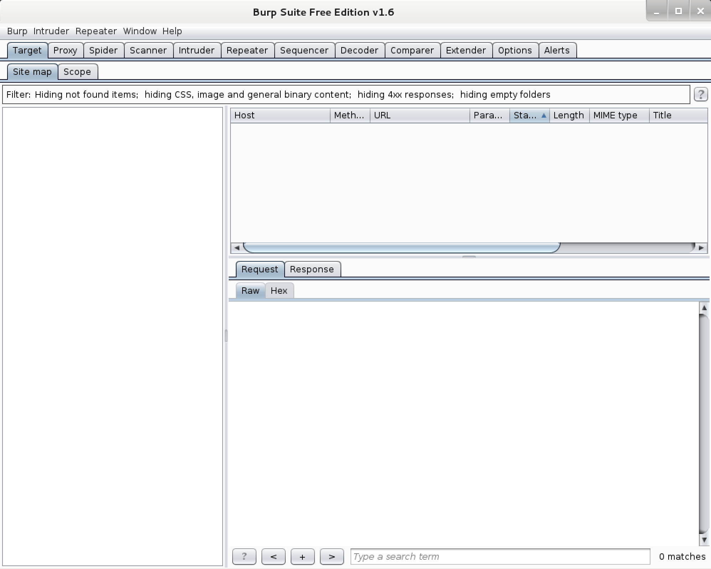

# 🎩 burpsuite

BurpSuite is a powerful security testing tool that is designed to assist in finding and exploiting vulnerabilities in web applications. It is a comprehensive solution that can be used for web application security testing, scanning, and analysis, as well as for penetration testing.

BurpSuite is a complete suite of tools that is used by security professionals and web application developers alike. It consists of four main components: the BurpSuite proxy, the BurpSuite scanner, the BurpSuite repeater, and the BurpSuite intruder.

The BurpSuite proxy is the core of the suite and is used to intercept and modify HTTP and HTTPS traffic between a web browser and a web server. This proxy enables security professionals to monitor and manipulate requests and responses in real-time, allowing them to identify and exploit vulnerabilities.

The BurpSuite scanner is a powerful automated vulnerability scanner that is designed to identify security vulnerabilities in web applications. It can identify a wide range of vulnerabilities including SQL injection, cross-site scripting (XSS), and file inclusion vulnerabilities.

The BurpSuite repeater is a tool that is used to test the repeatability of web application requests. It enables users to send requests repeatedly with different parameters and observe the response, making it a valuable tool for testing the robustness of web applications.

The BurpSuite intruder is a tool that is used to automate the testing of web application input vectors. It is designed to test for a range of vulnerabilities including SQL injection, cross-site scripting, and buffer overflow vulnerabilities.

In addition to its core components, BurpSuite includes several other tools that are designed to help security professionals and web application developers to identify and fix security vulnerabilities in web applications. These tools include the BurpSuite spider, which is used to crawl web applications and identify vulnerabilities, and the Burp Suite decoder, which is used to decode data that is encoded using various encoding schemes.

BurpSuite is a powerful tool that is widely used by security professionals and web application developers to identify and exploit vulnerabilities in web applications. It is a comprehensive solution that includes a wide range of tools that can be used to test and analyze web applications. Whether you are a security professional or a web application developer, BurpSuite is a must-have tool for ensuring the security of your web applications.

### Screenshots <a href="#screenshots" id="screenshots"></a>

```
burpsuite
```

[](../../.gitbook/assets/burpsuite.png)

***

\


### Packages and Binaries:

#### burpsuite <a href="#burpsuite" id="burpsuite"></a>

Burp Suite is an integrated platform for performing security testing of web applications. Its various tools work seamlessly together to support the entire testing process, from initial mapping and analysis of an application’s attack surface, through to finding and exploiting security vulnerabilities.

Burp gives you full control, letting you combine advanced manual techniques with state-of-the-art automation, to make your work faster, more effective, and more fun.

**Installed size:** `222.22 MB`\
**How to install:** `sudo apt install burpsuite`

<details>

<summary>Dependencies:</summary>

* default-jre
* java-wrappers

</details>

**burpsuite**

```
:~# burpsuite --help
Usage:
--help                            Print this message
--version                         Print version details
--disable-extensions              Prevent loading of extensions on startup
--diagnostics                     Print diagnostic information
--use-defaults                    Start with default settings
--collaborator-server             Run in Collaborator server mode
--collaborator-config             Specify Collaborator server configuration file; defaults to collaborator.config
--data-dir                        Specify data directory
--project-file                    Open the specified project file; this will be created as a new project if the file does not exist
--developer-extension-class-name  Fully qualified name of locally-developed extension class; extension will be loaded from the classpath
--config-file                     Load the specified project configuration file(s); this option may be repeated to load multiple files
--user-config-file                Load the specified user configuration file(s); this option may be repeated to load multiple files
--auto-repair                     Automatically repair a corrupted project file specified by the --project-file option
--unpause-spider-and-scanner      Do not pause the Spider and Scanner when opening an existing project
--disable-auto-update             Suppress auto update behavior

```

***

Updated on: 2023-Mar-08\


***
